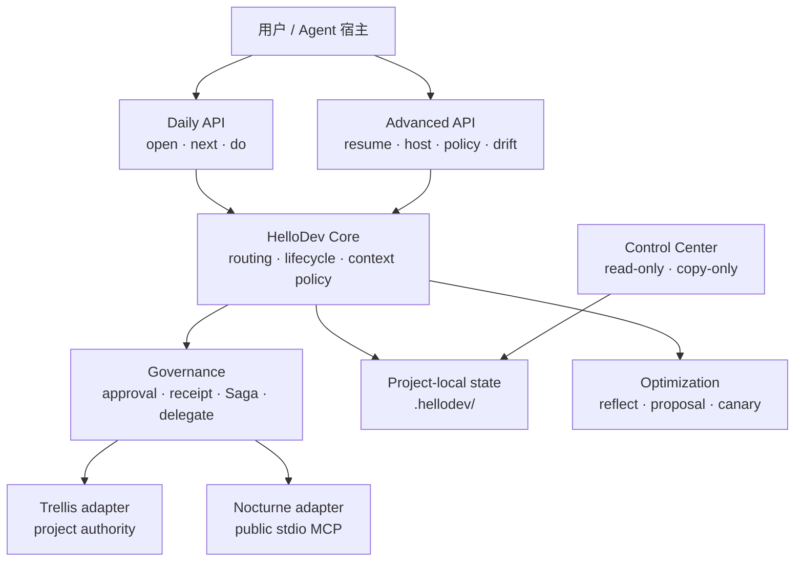

# HelloDev Core 0.11.0

HelloDev Core 是一个独立安装的 AI 开发编排 CLI。它把 Trellis 的项目工作流和 Nocturne 的长期知识能力放进同一套确定性入口，并补上上下文预算、授权回执、跨系统恢复、subagent 治理与可审计的策略优化。

```text
体验入口 = HelloDev
项目事实 = Trellis
长期经验 = Nocturne（可选、非权威）
实际执行 = Codex / Cursor / 其他 Agent 宿主
```

日常路径保持很薄：

```text
open -> next -> do
```

HelloDev 不要求 Codex 插件、Marketplace、Hooks 或 Desktop；不修改 Trellis/Nocturne 上游源码；不合并两边数据库；不自动修改用户级 Codex、Cursor 或系统配置。

第一次使用请先看 [五分钟快速上手](docs/QUICK_START.md)。

Codex / Cursor 用户安装后可以只说“用 HelloDev 完成这个任务：……”。Agent 应自行执行 `open/next/do`，只在消费 approval token、外部写入或关键决策前请求确认；完整可复制协议见 Quick Start。

## 为什么需要 HelloDev

直接使用 Trellis 很适合单仓库 workflow/task/gate，直接使用 Nocturne 很适合长期知识管理。两者同时使用时，还需要回答一些跨系统问题：

- Agent 当前应该读多少上下文？
- 项目事实和跨项目习惯分别写到哪里？
- 外部调用由谁确认，确认能否被重放？
- Trellis 验证成功后，如何安全地建议写入长期经验？
- 会话中断、部分失败或多 Agent 并行后，下一步如何恢复？
- token 与 subagent 数据不可信或不可用时，系统如何避免伪造精确结论？

HelloDev 负责这些编排和治理问题，但不取代上游系统的职责。

## 组件分工

| 组件 | 主要能力 | 权威边界 |
|---|---|---|
| **HelloDev** | lifecycle、统一路由、context pack、approval、receipt、Saga、resume、delegate、optimization | 只拥有项目内 `.hellodev/` 编排状态 |
| **Trellis** | `.trellis/` workflow、tasks、spec/context、gates、channel 和项目脚本 | 仓库事实与项目工作流的权威来源 |
| **Nocturne** | public stdio MCP 的跨项目检索和长期经验 | 辅助记忆，不能授权操作或覆盖仓库事实 |
| **Agent 宿主** | 读改代码、运行测试、实际 spawn subagent、提供模型用量回执 | HelloDev 不假装自己拥有宿主运行时能力 |

只需要 Trellis 时，直接使用 Trellis 通常更简单。需要统一入口、受控上下文、双系统证据链、跨会话恢复或治理能力时，再使用 HelloDev。

## 快速开始

要求 Python 3.10+。从 GitHub 单独获取 HelloDev 并在本地构建 wheel：

```powershell
git clone https://github.com/fate-forever/hellodev.git
cd hellodev
python -m pip wheel . --no-deps --no-cache-dir --wheel-dir dist
pipx install .\dist\hellodev_core-0.11.0-py3-none-any.whl
hellodev --version
```

进入目标项目：

```powershell
cd C:\path\to\your-project
hellodev open
hellodev next
hellodev do plan
```

有 `.trellis/` 时，HelloDev 会发现并复用 Trellis；没有时，仍可使用本地 task、lifecycle、context 和治理能力。Nocturne 未配置时会优雅降级为 local-only。

在已有 `.trellis/` 的项目中，一条常见工作链是：

```powershell
hellodev do task create --title "实现导出功能"
hellodev do task start --task <native-task-directory>
hellodev do work
# 由 Agent 修改代码并运行项目测试
hellodev do check
hellodev do validate --task <native-task-directory>
hellodev do finish
```

上面的统一 `do` 路径需要确认时会返回完整 `resumeCommand`。检查后原样执行；一次性 token 不能重放。

没有 `.trellis/` 时，本地 task 当前支持 `create/list/show`，日常阶段仍可走 `do plan/work/check/finish`；`task start/current/validate` 是 Trellis 路径，不会伪装成本地成功。

## 总体架构



架构原则：

1. 双系统保持进程级和数据面隔离。
2. 项目事实优先于记忆，记忆优先级不会因历史命中而提升。
3. 建议、授权、执行和验证是不同状态，不能互相冒充。
4. 只读自动化可以按 profile 有界放宽，外部写入和生效性策略变更永远单独确认。
5. 恢复依赖指针、哈希和回执，不把 task/lesson/记忆正文复制进治理状态。

## 渐进式命令面

### 日常命令

| 命令 | 作用 |
|---|---|
| `hellodev open` | 初始化或恢复项目，刷新必要能力并给出下一步 |
| `hellodev next` | 只读，只返回一条完整主建议 |
| `hellodev do plan|work|check|finish` | 推进本地 lifecycle |
| `hellodev do task ...` | 自动路由到 Trellis task 或本地 Markdown task |
| `hellodev do validate` | 运行经过验证的 Trellis task validation intent |
| `hellodev do recall` | 本地优先，必要时准备窄域 Nocturne 搜索 |
| `hellodev do remember` | 分类并准备证据门控的经验沉淀流程 |
| `hellodev status` | 查看 compact 项目状态 |

### 恢复与诊断

| 命令 | 作用 |
|---|---|
| `hellodev resume` | 从 lifecycle、WorkItem、Saga、receipt 和 brief 指纹恢复 |
| `hellodev saga next <id>` | 返回未完成 Saga 的唯一安全继续动作 |
| `hellodev doctor --fix-hints` | 只读诊断并给出修复提示 |
| `hellodev audit export` | 输出脱敏的本地审计投影 |

### 进阶治理

`brief`、`context`、`work`、`lesson`、`gate`、`delegate`、`usage`、`optimize`、`host`、`policy`、`drift`、`receipt` 和底层 adapter 命令都保留，但默认不应成为日常主线。完整列表以 `hellodev --help` 为准。

## 生命周期与下一步

HelloDev lifecycle 是本地编排状态：

```text
new -> started -> planned -> working -> checking -> finished
                         \-> blocked -> resume
```

它不会自动改 Trellis gate。`do validate` 成功后可以产生绑定当前 WorkItem 和能力指纹的 typed gate receipt；HelloDev 再用只读 gate projection 检查两边是否一致。

`next` 是唯一对外建议出口。它会依次考虑：

1. stale capability/brief。
2. 未完成或 partial Saga。
3. lifecycle 阶段和当前 WorkItem。
4. gate/finish policy 阻塞。
5. 最近的效率提示。

内部模块可以产生多种信号，但不会向用户暴露多套互相竞争的“下一步引擎”。

## 上下文分级与缓存

上下文选择是确定性、只读的，不会调用模型或 adapter：

```powershell
hellodev context suggest --intent status
hellodev context suggest --intent code
hellodev context pack --intent code --task <task-id> --token-budget 1200
hellodev context pack --resume --token-budget 256
```

| Level | 典型用途 | 最大策略预算 |
|---|---|---:|
| L0 | status、doctor、窄域检索计划 | 500 tokens |
| L1 | lifecycle、代码、任务、Trellis 读取 | 4,000 tokens |
| L2 | 外部写入、Saga、remember | 12,000 tokens |

显式 `--level` 可以覆盖建议；L2 仍需 `--allow-l2`。`token-budget` 是保守的 UTF-8 内容包上限，不是外部模型 tokenizer 的精确计数。

能力和 brief 指纹覆盖根 `AGENTS.md`、HelloDev 配置、Trellis workflow/context 及 `.trellis/scripts/` 中的常规文件。相关内容变化后缓存会 stale，`next` 会先建议 refresh。L1/L2 拒绝通过 symlink 读取不受控来源。

## Trellis 集成

HelloDev 先做能力发现，再执行有明确参数约束的 intent：

```powershell
hellodev trellis status
hellodev trellis intents
hellodev do task list
hellodev do task create --title "修复登录回归"
hellodev do validate --task <native-task-directory>
```

0.11.0 已验证的常用面包括 task、gate 和 channel 映射，其中 channel thread rename 保持读写分离和精确参数绑定。尚未覆盖的新命令可使用 native argv 逃生舱：

```powershell
hellodev trellis prepare -- --version
# 读取返回的 approval 后，显式传回底层 run
hellodev trellis run --approve "APPROVE-EXTERNAL:<returned-token>" -- --version
```

native escape hatch 只产生 generic command receipt，不能替代 `gate` / `test` 证据。Worktree 仍是明确未支持的统一 intent 缺口。

进入任何真实包含 `.trellis/` 的仓库时，Agent 仍必须先遵守该仓库的 `AGENTS.md`、`.trellis/workflow.md`、相关 context 和 task 状态。HelloDev 的能力发现不能替代仓库协议。

## Nocturne 集成

Nocturne 必须按项目显式配置 public stdio MCP。HelloDev 不读取宿主的 MCP 注册表，不连接 Nocturne 数据库，也不调用私有 REST/Dashboard：

```powershell
hellodev nocturne configure `
  --command "C:\path\to\python.exe" `
  --arg "C:\path\to\nocturne_memory\backend\mcp_server.py" `
  --cwd "C:\path\to\nocturne_memory"

hellodev nocturne status
hellodev nocturne tools
# 读取返回的 approval 后，再执行一次
hellodev nocturne tools --approve "APPROVE-EXTERNAL:<returned-token>"
```

底层 `trellis prepare/intent` 和 `nocturne tools/call` 返回 approval token，不承诺生成 `resumeCommand`；统一 `do` 路径才优先提供可原样复制的恢复命令。

统一召回路径：

```powershell
hellodev do recall `
  --query "我偏好的交接格式是什么？" `
  --domain preferences `
  --limit 5 `
  --namespace-scope shared
```

召回先查有界的本地 task、brief、Trellis workflow/context。强本地命中会停止；只有本地不足或显式 `--also-memory` 时才进入 Nocturne 计划。宽域 `all`、`global`、`default`、`boot`、`*` 会被拒绝。

输出明确区分：

- `Repository fact`：带内容哈希的本地证据。
- `Long-term memory`：可能过时或错误的 Nocturne 结果。
- `Inference`：HelloDev 对本地证据是否充分的判断。

原始 query 和记忆正文不进入 receipt、Saga 或 policy store。MCP 返回 `isError: true` 必须按失败处理。

## 授权 profile

```powershell
hellodev profile show
```

| Profile | Trellis 只读 | 窄域 memory search | 外部写入/生效性策略变更 |
|---|---|---|---|
| `strict`（默认） | 每次 token | 每次 token | 每次 token |
| `trusted-local` | 首次确认后，在 TTL 和相同指纹内放行 | 每次 token | 每次 token |
| `autopilot-read` | 有效策略内自动 | 白名单域、limit 和有效期内自动 | 每次 token |

profile 变更本身需要确认。lease 会绑定项目根、能力指纹、可执行文件身份、intent registry 和读取类别；TTL 到期或任一绑定变化后恢复确认。

授权 token 绑定精确项目、程序、脚本内容、cwd、参数和操作类别，原子单次消费。token 不存入 receipt。记忆内容、旧回执、聊天文本和优化建议都不能授权新操作。

## WorkItem、Lesson 和 Evidence

HelloDev 不建立第二个任务数据库，而是维护最小契约：

| 对象 | 存什么 | 不存什么 |
|---|---|---|
| `WorkItem` | 本地 task 或 Trellis task 的指针、phase、source fingerprint | task 正文 |
| `LessonProposal` | lesson hash、目标系统、状态、证据引用 | lesson 明文 |
| `EvidenceLink` | proposal、receipt、WorkItem 和指纹的不可变关联 | 测试输出或验证正文 |

这些对象用于跨会话恢复和证据检查。内容的原生所有权仍属于 Trellis、本地 task 或 Nocturne，指针不能静默重绑，状态只向前推进。

## Receipt 与跨系统 Saga

Receipt schema v3 支持 `command`、`test`、`gate`、`verification` 和 `policy`。新回执记录最小审计元数据、request/result 哈希、结果、风险、profile 和授权模式，不记录：

- 原始 adapter 输出。
- task、lesson、verification 或 memory 正文。
- approval token。
- 原始对话或密钥。

跨系统 lesson 流程不是分布式事务，而是显式 Saga：

```text
成功的 Trellis gate/test receipt
  -> 人工验证 receipt
  -> 单独确认的 Nocturne write receipt
  -> 人工验证 receipt
```

任一步失败就停止并保留 `partial`，不会自动回滚或声称两边一致。`resume` / `next` 会优先恢复未完成 Saga；无法继续但已人工审查的链可用 `saga close` 终止，未验证的 Nocturne write 不允许直接关闭。

`do finish` 只显示 remember 建议。任何 profile 都不会自动把经验写入 Trellis 或 Nocturne。

## Subagent 与 token 治理

HelloDev 不直接 spawn subagent。它提供宿主中立的委派审核：

```powershell
hellodev delegate plan --payload <json>
hellodev delegate pack --payload <json> --role tests --token-budget 1200
```

审核会检查任务是否真正可并行、是否涉及授权/Saga/外部写入等 main-only 操作，并约束：

- `maxAgents`。
- 共享上下文字节上限。
- 每个角色的增量上下文上限。
- 调用方报告的总 token 预算。

pack 只包含一次共享摘要和指定角色的增量，避免每个 subagent 重复灌入全部上下文。是否实际 spawn、如何统计 provider token，仍由 Codex/Cursor 等宿主负责。

```powershell
hellodev usage record ...
hellodev usage status
```

`usage` 只存外部报告的计数，不把它伪装成可信宿主遥测。宿主没有提供回执时，结果保持 `unavailable`；HelloDev 不估算精确 chat/subagent token。

## HostEnvelope 与策略演进

0.11.0 增加一个高级、宿主中立的闭环，但不改变日常入口。

### Host bridge

```powershell
hellodev host prepare ...
hellodev host status
hellodev host complete ...
```

`host prepare` 从已有 routing、context 和 delegation policy 构造有界、指纹绑定的 `HostEnvelope`。它只生成执行合同，不调用模型、不 spawn agent、不给 evidence 权威。

`host complete` 只接受与 envelope 匹配的脱敏结果；并发完成会在 cross-process lock 内重新校验绑定。用量仍是 host-asserted，不是 provider-verified。

### Optimization advisor

```powershell
hellodev optimize plan
hellodev optimize reflect ...
hellodev optimize proposals
```

reflection 记录隐私保护的 decision trace，并根据已有 usage/turn evidence 产生 `EvolutionProposal`。提案本身不具备执行、授权、gate 或记忆写入能力。

### Tighten-only policy

```powershell
hellodev policy status
hellodev policy stage ...
hellodev policy canary ...
hellodev policy evaluate
hellodev policy commit ...
hellodev policy revert ...
```

EvolutionProposal 以及后续 stage/canary/commit 只允许修改白名单内的效率参数，并且只能收紧。不能通过提案放宽 authorization、gate、evidence、adapter、memory scope、schema 或产品硬上限。经过授权的 `revert` 是例外：它只能恢复直接前一个 committed policy，不能提出新的放宽值或跨级回滚。

流程为：

```text
proposal -> stage -> bounded canary -> evaluate -> explicit commit
              |              |                         |
           cancel          revert                    revert
```

- stage/cancel 是 append-only 的本地非生效事件，因此不会消费生效性 policy approval；stage 仍会执行 tighten-only 校验。
- canary 只在限定 turn sample 内使用临时 overlay。
- commit 必须基于通过的当前 canary，并再次单独确认。
- revert 只能恢复最近一个尚未撤销的 committed policy 到其直接前一版本，不能任意跳历史。
- response 丢失时，可用精确 authorization receipt 恢复 canary/commit/revert，避免重复消费同一动作。

策略账本使用 `previousEventSha256` / `eventSha256` 的本地哈希链。它能发现结构错误、断链、局部编辑和外部 checkpoint 不匹配，但不能防御拥有完整项目写权限的人重写整条历史。需要检测完整重写时，必须把预期 head 保存在项目外：

```powershell
hellodev drift status --expected-head <external-checkpoint-sha256-or-GENESIS>
```

`drift status` 只读，报告 capability/WorkItem staleness、canary 过期、checkpoint 不匹配、预算、重试和 subagent policy 等有限窗口内的发现；它不会自动修复。

完整演示见 [EVOLUTION_DEMO.md](docs/EVOLUTION_DEMO.md)。

## Control Center

```powershell
hellodev dashboard start
hellodev dashboard status
hellodev dashboard stop
```

Control Center 监听 loopback，默认 `127.0.0.1:8242`，每次启动使用独立 browser token。schema v4 可投影 lifecycle、capability、brief、usage、optimization、host、policy 和 drift 的脱敏摘要。

它明确声明：

```text
copyOnly=true
applyAllowed=false
commitAllowed=false
revertAllowed=false
actionApiAvailable=false
```

页面只能查看和复制命令，不能执行 adapter、模型、profile、policy、approval、reconcile 或 delegation，也不显示完整 envelope、policy 值、完整哈希、记忆正文或原始发现。LessonProposal 只可显示必要的截断 digest。

## 项目状态与升级

所有 HelloDev 运行状态位于选定项目的 `.hellodev/`。0.8、0.9 和 0.10.x 项目可以直接由 0.11.0 打开；新增 store 采用按需创建，read-only 命令不会为了升级而提前写入缺失文件。

主要状态层包括 lifecycle、capability、brief、task/WorkItem、receipt、Saga、profile、usage、optimization、host completion 和 evolution policy。旧 receipt schema 仍可读，在下一次合法写入时向 schema v3 归一化；迁移不会给旧回执增加新的 evidence 权威。

开发源码、release snapshot 和已安装 runtime 必须是三个独立真实目录，禁止通过 symlink、junction 或 Marketplace 条目把运行态直接指向开发源码。

## 安全边界

- Trellis 是仓库事实，Nocturne 是不可信辅助数据。
- 外部写入、profile/gate policy 变更以及 canary/commit/revert 等生效性策略操作，在任何 profile 下都需要精确确认。
- memory、proposal、context pack、HostEnvelope 和 dashboard 都不能授权工具调用。
- 通用 command receipt 不能替代 typed gate/test evidence。
- `host prepare` 不执行任务，`delegate plan` 不 spawn agent，`drift status` 不修复状态。
- Saga 明确承认 partial，不宣称跨数据库原子性或自动补偿。
- hash chain 是本地完整性检查，不是透明日志、远程见证或不可抵赖证明。
- exact provider token 采集属于外部宿主；缺失时显示 unavailable。
- HelloDev 不执行 bootstrap/global install，不修改 shell、Cursor、Codex 或 Nocturne 全局配置。

## 当前限制

- Trellis worktree 尚未进入验证过的统一 intent 面。
- Trellis gate 不会自动驱动 HelloDev lifecycle。
- Dashboard 保持只读，不能直接点击执行命令。
- Nocturne 仅支持显式 public stdio MCP，不支持数据库直连、HTTP 私有接口或自动扫描全库。
- 没有任意历史 policy rollback，只支持直接前一 committed policy 的有界 revert。
- 本地哈希链无法单独发现攻击者对项目内完整历史和 head 的一致性重写。
- HelloDev 不是 Agent runtime；实际模型调用、代码编辑、测试执行和 subagent spawn 由宿主负责。

## 开发与验证

GitHub 仓库根目录就是独立 HelloDev 源码；在原研究工作区中，它对应 `packages/hellodev-core`：

```powershell
cd hellodev
python scripts\verify.py --scope fast
python scripts\verify.py --scope full
$env:PYTHONPATH='src'
python -m hellodev snapshot verify --path .
```

构建 wheel：

```powershell
python -m pip wheel . --no-deps --no-cache-dir --wheel-dir dist
Get-FileHash .\dist\hellodev_core-0.11.0-py3-none-any.whl -Algorithm SHA256
```

0.11.0 发布门禁结果：

- fast：113 tests，0 failures，1 个 Windows symlink 条件 skip。
- full：145 tests，0 failures，同一条件 skip。
- 真实 disposable Trellis、隐私、drift、schema-v4 Dashboard 和隔离 wheel smoke 通过。
- 原始研究工作区的不可变 release 证据保存在 `outputs/hellodev-core-releases/0.11.0/`；该目录不会提交到本 GitHub 仓库。
- wheel SHA-256：`977065c806bb12cc45ed804a8858eb8cc9f58bbc9ce3e9f789f01e601024f260`。

完整发布流程见 [RELEASE.md](docs/RELEASE.md)。

## 文档维护约定

每次版本更新必须同步检查并更新：

1. 本 README 的版本、能力、限制和验证数据。
2. [QUICK_START.md](docs/QUICK_START.md) 的安装路径和日常命令。
3. `pyproject.toml` 版本。
4. `docs/RELEASE.md` 与对应版本发布说明。
5. 仓库根 `HELLODEV_DEVELOPMENT_PROGRESS.md` 的事实、证据和剩余风险。

不允许把未发布规划写成已完成功能，也不允许从历史 `outputs/` 文档复制已经过期的版本和命令。

## 延伸文档

| 文档 | 内容 |
|---|---|
| [QUICK_START.md](docs/QUICK_START.md) | 新手安装与日常使用 |
| [F1_DEMO.md](docs/F1_DEMO.md) | `open/next/do`、recall/remember 和 profile 基线 |
| [F2_DEMO.md](docs/F2_DEMO.md) | WorkItem、Evidence、Saga 和跨会话恢复 |
| [DISCLOSURE_DEMO.md](docs/DISCLOSURE_DEMO.md) | daily/recovery/advanced 渐进式披露 |
| [OPTIMIZE_DEMO.md](docs/OPTIMIZE_DEMO.md) | usage、reflection 和 proposal |
| [EVOLUTION_DEMO.md](docs/EVOLUTION_DEMO.md) | HostEnvelope、policy canary、revert 和 drift |
| [RELEASE.md](docs/RELEASE.md) | 测试、构建、快照和发布门禁 |

许可证：MIT。
