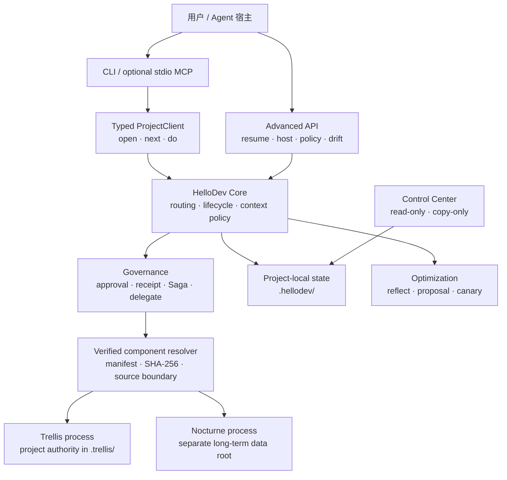

# HelloDev Core 0.14.1

HelloDev Core 是一个独立安装的 AI 开发编排 CLI。它把 Trellis 的项目工作流和 Nocturne 的长期知识能力放进同一套确定性入口，并补上上下文预算、授权回执、跨系统恢复、subagent 治理与可审计的策略优化。

```text
体验入口 = HelloDev
项目事实 = Trellis
长期经验 = Nocturne（可选、非权威）
实际执行 = Codex / Cursor / 其他 Agent 宿主
```

日常路径保持很薄：

```text
open -> next -> do
```

0.11.2 会在 Codex 的下一次 `open` 中补采此前已完成但尚未记录的回合。每累计 20 条可信的 `runtime-observed` 精确回执，就生成一个不重叠、可校验的 `ReflectionCycle`，分析平均 token、缓存复用与 subagent 占比，并把一条节省建议挂到既有 `next/status`；它不调用模型，也不会自动应用策略。

0.12.0 把可靠性补到策略生效链：approval token 验证后先进入追加式事务 WAL，再完成 token consume、policy receipt 和 ledger event；任一步中断都由 `next/resume` 推荐一条 `transaction recover` 命令，不需要重新授权。同时提供类型化 Python Host SDK、JSON Schema、协议协商、Canary Evaluation v2 和可移植 policy checkpoint。

0.12.1 是兼容的 OSS polish 补丁：补齐 receipt/WAL 与多进程恢复测试，checkpoint 可选择以非零退出码作为 CI 门禁，Host SDK 作为 PEP 561 typed package 发布并增加精确 pending/reconcile/abandon 接口，同时加入 GitHub Actions、零上游依赖 Demo、Host SDK 示例和开源协作文档。Host protocol、状态 schema、Canary 判定策略和日常入口均未扩张。

0.13.0 增加 Agent-native 接入层：CLI 与可选的官方 SDK stdio MCP gateway 共用一个 root-bound、类型化 `ProjectClient`，Codex/Cursor 可以调用六个有界工具而不再拼 CLI JSON。`integrate show/check` 只生成和检查项目级配置，不静默修改宿主；基础 Core 仍为零运行依赖，MCP 通过 `hellodev-core[mcp]` 可选安装。默认 `--help` 只披露日常与接入命令，`--help-all` 才显示治理和底层适配器表面。

0.14.0 增加统一发行层：平台 bundle 携带锁定的 Trellis、Nocturne 和各自运行时，用户不再分别安装两套上游。首个发行目标仅为 Windows x86_64；只有 exact archive 完成离线 smoke 并附带发布 SHA-256 后才算受支持。`setup` 校验本地 bundle 字节并创建独立 Nocturne 数据根，`onboard` 一次完成项目 `.hellodev/`、内置 Nocturne 选择和 Cursor/Codex 项目接入。组件仍以独立进程运行，`.trellis/`、`.hellodev/` 和 Nocturne 数据库不会合并；已有 0.13 项目也不会因升级而静默启用记忆。

0.14.1 同时修复任务连续性披露：Control Center 分开显示 HelloDev 本地任务、Trellis 活跃任务与 WorkItem 指针；`hellodev work activate --trellis-task <name>` 在一个已完成周期后显式关联既有 Trellis task 并开始新的可审计生命周期，不复制 task 正文也不自动猜测任务。

HelloDev 不要求 Codex 插件、Marketplace、Hooks 或 Desktop；不修改 Trellis/Nocturne 上游源码；不合并两边数据库；不自动修改用户级 Codex、Cursor 或系统配置。

第一次使用请先看 [五分钟快速上手](docs/QUICK_START.md)。

Codex / Cursor 用户安装后可以只说“用 HelloDev 完成这个任务：……”。Agent 应自行执行 `open/next/do`，只在消费 approval token、外部写入或关键决策前请求确认；完整可复制协议见 Quick Start。

## English summary

HelloDev is a local, deterministic orchestration and governance framework for AI-assisted development. Its typed `ProjectClient`, CLI, and official-SDK stdio MCP gateway share one bounded application path. Version 0.14 adds a manifest-checked platform bundle that can distribute Trellis and Nocturne without merging their processes or data planes. The first release target is Windows x86_64. Manifest checks establish local byte consistency only; they are not signatures, provenance, tamper-proofing, or legal review. Core does not execute models, auto-write memory, edit user-level host configuration, or treat host-reported usage as provider-attested evidence.

## 为什么需要 HelloDev

直接使用 Trellis 很适合单仓库 workflow/task/gate，直接使用 Nocturne 很适合长期知识管理。两者同时使用时，还需要回答一些跨系统问题：

- Agent 当前应该读多少上下文？
- 项目事实和跨项目习惯分别写到哪里？
- 外部调用由谁确认，确认能否被重放？
- Trellis 验证成功后，如何安全地建议写入长期经验？
- 会话中断、部分失败或多 Agent 并行后，下一步如何恢复？
- token 与 subagent 数据不可信或不可用时，系统如何避免伪造精确结论？

HelloDev 负责这些编排和治理问题，但不取代上游系统的职责。

## 组件分工

| 组件 | 主要能力 | 权威边界 |
|---|---|---|
| **HelloDev** | lifecycle、统一路由、context pack、approval、receipt、Saga、resume、delegate、optimization | 只拥有项目内 `.hellodev/` 编排状态 |
| **Trellis** | `.trellis/` workflow、tasks、spec/context、gates、channel 和项目脚本 | 仓库事实与项目工作流的权威来源 |
| **Nocturne** | public stdio MCP 的跨项目检索和长期经验 | 辅助记忆，不能授权操作或覆盖仓库事实 |
| **Agent 宿主** | 读改代码、运行测试、实际 spawn subagent、提供模型用量回执 | HelloDev 不假装自己拥有宿主运行时能力 |

只需要 Trellis 时，直接使用 Trellis 通常更简单。需要统一入口、受控上下文、双系统证据链、跨会话恢复或治理能力时，再使用 HelloDev。

## 快速开始

普通用户默认使用维护者提供并附带发布 SHA-256 的平台 bundle。0.14.1 首个受支持平台仅为 Windows x86_64；以下命令适用于已经完成 exact offline smoke 的 archive。它包含 HelloDev、Trellis、Nocturne 和所需运行时：

```powershell
cd C:\path\to\hellodev-0.14.1-windows-x86_64
.\bin\hellodev.cmd setup
cd C:\path\to\your-project
C:\path\to\hellodev-0.14.1-windows-x86_64\bin\hellodev.cmd onboard --host cursor --with-trellis
```

`onboard` 会写入项目级 `.cursor/mcp.json` 和 `.cursor/rules/hellodev.mdc`，不会修改全局 Cursor、PATH、注册表或已有外部 Nocturne 数据。若要求初始化 `.trellis/`，它只返回一次性确认和完整恢复命令；确认后由 Agent 执行。

`components verify` 只核对本地文件大小/SHA-256、版本和 SPDX 元数据是否与随包 manifest/lock 一致。它不证明数字签名、远程来源、不可篡改性，也不替代独立许可证或法律审查。

重新加载 Cursor 后只需说：

```text
用 HelloDev 完成这个任务：<任务>。验收：<标准>。持续推进到测试通过，需要授权时再问我。
```

Core wheel 仍供开发者、CI 和外部组件模式使用，但它不等同于包含上游载荷的平台 bundle。`pipx` 仅用于 exact 本地 wheel 或后续已独立验证的公开包；当前文档不宣称 0.14.1 已发布到 PyPI。GitHub Release、PyPI upload 和后续平台 archive 仍是单独授权动作。

有 `.trellis/` 时，HelloDev 会发现并复用 Trellis；没有时，仍可使用本地 task、lifecycle、context 和治理能力。Nocturne 未配置时会优雅降级为 local-only。

在已有 `.trellis/` 的项目中，一条常见工作链是：

```powershell
hellodev do task create --title "实现导出功能"
hellodev do task start --task <native-task-directory>
hellodev do work
# 由 Agent 修改代码并运行项目测试
hellodev do check
hellodev do validate --task <native-task-directory>
hellodev do finish
```

上面的统一 `do` 路径需要确认时会返回完整 `resumeCommand`。检查后原样执行；一次性 token 不能重放。

没有 `.trellis/` 时，本地 task 当前支持 `create/list/show`，日常阶段仍可走 `do plan/work/check/finish`；`task start/current/validate` 是 Trellis 路径，不会伪装成本地成功。

## 总体架构



架构原则：

1. 双系统保持进程级和数据面隔离。
2. 项目事实优先于记忆，记忆优先级不会因历史命中而提升。
3. 建议、授权、执行和验证是不同状态，不能互相冒充。
4. 只读自动化可以按 profile 有界放宽，外部写入和生效性策略变更永远单独确认。
5. 恢复依赖指针、哈希和回执，不把 task/lesson/记忆正文复制进治理状态。

## Codex / Cursor 的 Agent-native 接入

0.13.0 的 MCP gateway 在启动时绑定一个项目根目录，只暴露：

```text
hellodev_open      hellodev_next       hellodev_resume
hellodev_status    hellodev_context    hellodev_do
```

它不暴露任意 argv、原生 Trellis/Nocturne 调用、policy commit/revert、Dashboard 或 HostEnvelope。基础安装不导入 MCP SDK；缺少 extra 时 `mcp serve` 会给出可执行的安装提示。

先生成项目级配置片段：

```powershell
hellodev integrate show --host codex
hellodev integrate show --host cursor
hellodev integrate check --host codex
```

`show/check` 不读取或修改全局 Codex/Cursor 配置。审阅片段后再由你或 Agent 写入目标项目的 `.codex/config.toml` 或 `.cursor/mcp.json`。MCP tool annotation 只是宿主提示，不能证明人类已经确认；`hellodev_do` 仍保留原有精确、一次性 approval token 语义，任何 profile 下的外部写入都不会自动授权。

## 渐进式命令面

### 日常命令

| 命令 | 作用 |
|---|---|
| `hellodev open` | 初始化或恢复项目，刷新必要能力并给出下一步 |
| `hellodev next` | 只读，只返回一条完整主建议 |
| `hellodev do plan|work|check|finish` | 推进本地 lifecycle |
| `hellodev do task ...` | 自动路由到 Trellis task 或本地 Markdown task |
| `hellodev do validate` | 运行经过验证的 Trellis task validation intent |
| `hellodev do recall` | 本地优先，必要时准备窄域 Nocturne 搜索 |
| `hellodev do remember` | 分类并准备证据门控的经验沉淀流程 |
| `hellodev status` | 查看 compact 项目状态 |

### 恢复与诊断

| 命令 | 作用 |
|---|---|
| `hellodev resume` | 从 lifecycle、WorkItem、Saga、receipt 和 brief 指纹恢复 |
| `hellodev saga next <id>` | 返回未完成 Saga 的唯一安全继续动作 |
| `hellodev doctor --fix-hints` | 只读诊断并给出修复提示 |
| `hellodev audit export` | 输出脱敏的本地审计投影 |

### 进阶治理

`brief`、`context`、`work`、`lesson`、`gate`、`delegate`、`usage`、`optimize`、`host`、`policy`、`drift`、`receipt` 和底层 adapter 命令都保留，但默认不应成为日常主线。`hellodev --help` 只显示日常/接入面；完整列表用 `hellodev --help-all` 查看。

## 生命周期与下一步

HelloDev lifecycle 是本地编排状态：

```text
new -> started -> planned -> working -> checking -> finished
                         \-> blocked -> resume
```

它不会自动改 Trellis gate。`do validate` 成功后可以产生绑定当前 WorkItem 和能力指纹的 typed gate receipt；HelloDev 再用只读 gate projection 检查两边是否一致。

`next` 是唯一对外建议出口。它会依次考虑：

1. stale capability/brief。
2. 未完成或 partial Saga。
3. lifecycle 阶段和当前 WorkItem。
4. gate/finish policy 阻塞。
5. 最近的效率提示。

内部模块可以产生多种信号，但不会向用户暴露多套互相竞争的“下一步引擎”。

## 上下文分级与缓存

上下文选择是确定性、只读的，不会调用模型或 adapter：

```powershell
hellodev context suggest --intent status
hellodev context suggest --intent code
hellodev context pack --intent code --task <task-id> --token-budget 1200
hellodev context pack --resume --token-budget 256
```

| Level | 典型用途 | 最大策略预算 |
|---|---|---:|
| L0 | status、doctor、窄域检索计划 | 500 tokens |
| L1 | lifecycle、代码、任务、Trellis 读取 | 4,000 tokens |
| L2 | 外部写入、Saga、remember | 12,000 tokens |

显式 `--level` 可以覆盖建议；L2 仍需 `--allow-l2`。`token-budget` 是保守的 UTF-8 内容包上限，不是外部模型 tokenizer 的精确计数。

能力和 brief 指纹覆盖根 `AGENTS.md`、HelloDev 配置、Trellis workflow/context 及 `.trellis/scripts/` 中的常规文件。相关内容变化后缓存会 stale，`next` 会先建议 refresh。L1/L2 拒绝通过 symlink 读取不受控来源。

## Trellis 集成

HelloDev 先做能力发现，再执行有明确参数约束的 intent：

```powershell
hellodev trellis status
hellodev trellis intents
hellodev do task list
hellodev do task create --title "修复登录回归"
hellodev do validate --task <native-task-directory>
```

0.11.0 已验证的常用面包括 task、gate 和 channel 映射，其中 channel thread rename 保持读写分离和精确参数绑定。尚未覆盖的新命令可使用 native argv 逃生舱：

```powershell
hellodev trellis prepare -- --version
# 读取返回的 approval 后，显式传回底层 run
hellodev trellis run --approve "APPROVE-EXTERNAL:<returned-token>" -- --version
```

native escape hatch 只产生 generic command receipt，不能替代 `gate` / `test` 证据。Worktree 仍是明确未支持的统一 intent 缺口。

进入任何真实包含 `.trellis/` 的仓库时，Agent 仍必须先遵守该仓库的 `AGENTS.md`、`.trellis/workflow.md`、相关 context 和 task 状态。HelloDev 的能力发现不能替代仓库协议。

## Nocturne 集成

平台 bundle 中的 Nocturne 仍需通过一次显式 `onboard` 才会在项目中启用；0.13 的旧项目不会因升级而自动获得记忆访问。外部安装仍可显式配置 public stdio MCP。HelloDev 不读取宿主 MCP 注册表、不直连数据库，也不调用私有 REST：

```powershell
hellodev onboard --host cursor
hellodev nocturne status
```

外部覆盖方式：

```powershell
hellodev nocturne configure `
  --command "C:\path\to\python.exe" `
  --arg "C:\path\to\nocturne_memory\backend\mcp_server.py" `
  --cwd "C:\path\to\nocturne_memory"

hellodev nocturne status
hellodev nocturne tools
# 读取返回的 approval 后，再执行一次
hellodev nocturne tools --approve "APPROVE-EXTERNAL:<returned-token>"
```

底层 `trellis prepare/intent` 和 `nocturne tools/call` 返回 approval token，不承诺生成 `resumeCommand`；统一 `do` 路径才优先提供可原样复制的恢复命令。

统一召回路径：

```powershell
hellodev do recall `
  --query "我偏好的交接格式是什么？" `
  --domain preferences `
  --limit 5 `
  --namespace-scope shared
```

召回先查有界的本地 task、brief、Trellis workflow/context。强本地命中会停止；只有本地不足或显式 `--also-memory` 时才进入 Nocturne 计划。宽域 `all`、`global`、`default`、`boot`、`*` 会被拒绝。

输出明确区分：

- `Repository fact`：带内容哈希的本地证据。
- `Long-term memory`：可能过时或错误的 Nocturne 结果。
- `Inference`：HelloDev 对本地证据是否充分的判断。

原始 query 和记忆正文不进入 receipt、Saga 或 policy store。MCP 返回 `isError: true` 必须按失败处理。

## 授权 profile

```powershell
hellodev profile show
```

| Profile | Trellis 只读 | 窄域 memory search | 外部写入/生效性策略变更 |
|---|---|---|---|
| `strict`（默认） | 每次 token | 每次 token | 每次 token |
| `trusted-local` | 首次确认后，在 TTL 和相同指纹内放行 | 每次 token | 每次 token |
| `autopilot-read` | 有效策略内自动 | 白名单域、limit 和有效期内自动 | 每次 token |

profile 变更本身需要确认。lease 会绑定项目根、能力指纹、可执行文件身份、intent registry 和读取类别；TTL 到期或任一绑定变化后恢复确认。

授权 token 绑定精确项目、程序、脚本内容、cwd、参数和操作类别，原子单次消费。token 不存入 receipt。记忆内容、旧回执、聊天文本和优化建议都不能授权新操作。

## WorkItem、Lesson 和 Evidence

HelloDev 不建立第二个任务数据库，而是维护最小契约：

| 对象 | 存什么 | 不存什么 |
|---|---|---|
| `WorkItem` | 本地 task 或 Trellis task 的指针、phase、source fingerprint | task 正文 |
| `LessonProposal` | lesson hash、目标系统、状态、证据引用 | lesson 明文 |
| `EvidenceLink` | proposal、receipt、WorkItem 和指纹的不可变关联 | 测试输出或验证正文 |

这些对象用于跨会话恢复和证据检查。内容的原生所有权仍属于 Trellis、本地 task 或 Nocturne，指针不能静默重绑，状态只向前推进。

## Receipt 与跨系统 Saga

Receipt schema v3 支持 `command`、`test`、`gate`、`verification` 和 `policy`。新回执记录最小审计元数据、request/result 哈希、结果、风险、profile 和授权模式，不记录：

- 原始 adapter 输出。
- task、lesson、verification 或 memory 正文。
- approval token。
- 原始对话或密钥。

跨系统 lesson 流程不是分布式事务，而是显式 Saga：

```text
成功的 Trellis gate/test receipt
  -> 人工验证 receipt
  -> 单独确认的 Nocturne write receipt
  -> 人工验证 receipt
```

任一步失败就停止并保留 `partial`，不会自动回滚或声称两边一致。`resume` / `next` 会优先恢复未完成 Saga；无法继续但已人工审查的链可用 `saga close` 终止，未验证的 Nocturne write 不允许直接关闭。

`do finish` 只显示 remember 建议。任何 profile 都不会自动把经验写入 Trellis 或 Nocturne。

## Subagent 与 token 治理

HelloDev 不直接 spawn subagent。它提供宿主中立的委派审核：

```powershell
hellodev delegate plan --payload <json>
hellodev delegate pack --payload <json> --role tests --token-budget 1200
```

审核会检查任务是否真正可并行、是否涉及授权/Saga/外部写入等 main-only 操作，并约束：

- `maxAgents`。
- 共享上下文字节上限。
- 每个角色的增量上下文上限。
- 调用方报告的总 token 预算。

pack 只包含一次共享摘要和指定角色的增量，避免每个 subagent 重复灌入全部上下文。是否实际 spawn 仍由 Codex/Cursor 等宿主负责；HelloDev 可以采集已完成的本地 Codex runtime 计数，但 provider attestation 仍不属于 Core。

```powershell
# Codex：默认用 CODEX_THREAD_ID 定位当前 rollout，收集上一已完成回合
hellodev usage collect

# 补采当前 rollout 中所有尚未记录的已完成回合，并更新 20 回合反思周期
hellodev usage sync

# 诊断/导入：显式选择线程或 rollout JSONL（信任级别会降为 asserted-runtime）
hellodev usage collect --thread-id <codex-thread-uuid> --codex-home C:\path\to\.codex
hellodev usage collect --session C:\path\to\rollout-....jsonl

hellodev usage status
hellodev usage record ...  # 保留的人工上报入口
```

`usage collect` 是 Codex 本地运行时采集器，只选择 rollout 中最后一个已有 `task_complete` 的回合；`usage sync` 按最早未记录回合开始补采，默认最多 100 条，可用 `--limit 1..500` 控制。`open` 在 Desktop 提供 `CODEX_THREAD_ID` 且项目根与当前工作目录一致时会机会式调用同一 sync 链路。两者都用累计 token 快照计算回合区间，并递归汇总区间内可完整定位的 subagent 会话。由于当前回复结束后才会出现最终完成事件，**正在生成的回复不能给出自身最终用量**；它只能在后续回合被补采。

由 Desktop 注入的 `CODEX_THREAD_ID` 自动发现链路标记为 `measurement=exact`、`sourceTrust=runtime-observed`、`attestation=none`。显式 `--thread-id`、`--codex-home` 或 `--session` 属于调用方选择的诊断输入，只标记为 `sourceKind=codex-runtime-import`、`sourceTrust=asserted-runtime`；区间差分仍是 exact，但来源不自动升级为受信运行时观察。两者都不是 provider 签名或 provider-verified 证明。持久化内容仅含计数、完成时间和不可逆摘要，不保存 prompt、回复、原始事件、线程 ID 或会话路径。

如果没有完成回合，结果为 `unavailable` 且不写入；缺失/未完成的 subagent rollout、区间内无 token 快照、事件结构异常、累计值回退或同一回合计数冲突都会 fail-closed，不保存部分值，也不会估算或把缺失值写成 0。`usage record` 仍是 `operator-report` / `asserted`，不能冒充 runtime-observed。`usage status` 的 ledger totals 是历史记录总和，可能包含不同信任来源；判断“上一轮”时应读取 `preferredDetails.completedAt` 和对应 breakdown。运行时收据保存在新增的 `.hellodev/usage-receipts.json`，旧 `.hellodev/usage.json` 保持 schema v1，因此回退到 0.11.0 时会忽略新 sidecar 而不是读坏旧账本。

只有自动发现产生的 `runtime-observed + exact` 回执进入 `.hellodev/reflection-cycles.json`。每 20 条形成一个固定窗口；19 条不会提前反思，21 条是一个周期加一条待累计。显式 `--thread-id/--codex-home/--session` 导入始终是 `asserted-runtime`，即使区间数值精确也不能驱动周期。周期记录为 hash-bound additive sidecar，只含计数、趋势码、固定 allowlist 建议和 `applyAllowed=false` 边界；不会保存对话正文、调用模型、访问 adapter、写入 Nocturne 或自动改变 policy。

## HostEnvelope 与策略演进

0.11.0 增加一个高级、宿主中立的闭环，但不改变日常入口。

### Host bridge

```powershell
hellodev host prepare ...
hellodev host status
hellodev host pending <envelope-id>
hellodev host complete ...
hellodev host protocol --version 1.0
hellodev host sdk
```

`host prepare` 从已有 routing、context 和 delegation policy 构造有界、指纹绑定的 `HostEnvelope`。Core 仅持久化 pending Envelope 的 id/hash/intent/expiry 等脱敏元数据，不保存 context 正文。Python 宿主使用 `hellodev.host_sdk.HostClient`、`HostRequest`、`HostEnvelope` 和 `HostResult`，无需手工拼 JSON；bundle 内同时提供 HostEnvelope/HostResult/protocol JSON Schema。

`host complete` 只接受与 envelope 匹配的脱敏结果；并发完成会在 cross-process lock 内重新校验绑定。用量仍是 host-asserted，不是 provider-verified。0.12.1 的 wheel 包含 `py.typed`；`HostClient.pending_one/reconcile/abandon` 和公开 SDK 异常让宿主可以协调保留在宿主侧的完整 Envelope，而 Core 仍只保存脱敏 pending 元数据。

### Optimization advisor

```powershell
hellodev optimize plan
hellodev optimize reflect ...
hellodev optimize proposals
```

reflection 记录隐私保护的 decision trace，并根据已有 usage/turn evidence 产生 `EvolutionProposal`。提案本身不具备执行、授权、gate 或记忆写入能力。

### Tighten-only policy

```powershell
hellodev policy status
hellodev policy stage ...
hellodev policy canary ...
hellodev policy evaluate
hellodev policy commit ...
hellodev policy revert ...
```

EvolutionProposal 以及后续 stage/canary/commit 只允许修改白名单内的效率参数，并且只能收紧。不能通过提案放宽 authorization、gate、evidence、adapter、memory scope、schema 或产品硬上限。经过授权的 `revert` 是例外：它只能恢复直接前一个 committed policy，不能提出新的放宽值或跨级回滚。

流程为：

```text
proposal -> stage -> bounded canary -> evaluate -> explicit commit
              |              |                         |
           cancel          revert                    revert
```

- stage/cancel 是 append-only 的本地非生效事件，因此不会消费生效性 policy approval；stage 仍会执行 tighten-only 校验。
- canary 只在限定 turn sample 内使用临时 overlay。
- commit 必须基于通过的当前 canary，并再次单独确认。
- revert 只能恢复最近一个尚未撤销的 committed policy 到其直接前一版本，不能任意跳历史。
- response 丢失时，可用精确 authorization receipt 恢复 canary/commit/revert，避免重复消费同一动作。
- v0.12 的 `.hellodev/transactions.json` 把 authorization、token-consumed、receipt-recorded、ledger-applied 记录为追加事件。`hellodev transaction status|recover` 可从断电、写盘失败或进程中断处幂等续跑，原始 token 永不落盘。
- Canary Evaluation v2 要求同样大小的 baseline 与 canary HostCompletion 样本，比较成功率、平均重试、平均委派和预算超限率；证据不足或出现回退时 commit 直接拒绝。Token 仅在两侧全是 `host-asserted` 时做标注清晰的参考比较，否则保持 unavailable，永不称为 provider-verified。

策略账本使用 `previousEventSha256` / `eventSha256` 的本地哈希链。v0.12 可导出、保存和验证可移植 checkpoint：

```powershell
hellodev policy checkpoint export
hellodev policy checkpoint save
hellodev policy checkpoint verify --file .\policy-checkpoint.json
hellodev policy checkpoint verify --file .\policy-checkpoint.json --require-match
```

将导出的 checkpoint 交给 CI、Git 或外部 Host 独立保存，才能发现完整本地历史被整体改写。`--require-match` 会在 mismatch 时保留结构化输出并返回 exit code 2，便于 CI 门禁。项目内保存的副本方便状态提示，但本身不构成远程见证、不可篡改账本或不可抵赖证明。

`drift status` 只读，报告 capability/WorkItem staleness、canary 过期、checkpoint 不匹配、预算、重试和 subagent policy 等有限窗口内的发现；它不会自动修复。

完整演示见 [EVOLUTION_DEMO.md](docs/EVOLUTION_DEMO.md)。

## Control Center

```powershell
hellodev dashboard start
hellodev dashboard status
hellodev dashboard stop
```

Control Center 监听 loopback，默认 `127.0.0.1:8242`，每次启动使用独立 browser token。schema v7 增加 pending transaction、pending HostEnvelope、Canary v2 对比、checkpoint 和 Host protocol 投影；仍只显示脱敏计数、状态和固定只读命令，不显示正文、approval token、完整 Envelope、policy patch 或执行端点。

它明确声明：

```text
copyOnly=true
applyAllowed=false
commitAllowed=false
revertAllowed=false
actionApiAvailable=false
```

页面只能查看和复制命令，不能执行 adapter、模型、profile、policy、approval、reconcile 或 delegation，也不显示完整 envelope、policy 值、完整哈希、记忆正文或原始发现。LessonProposal 只可显示必要的截断 digest。

## 项目状态与升级

所有 HelloDev 编排状态位于选定项目的 `.hellodev/`。0.8 至 0.13 项目可以直接由 0.14.1 打开；transaction、pending HostEnvelope 和 checkpoint store 都按需创建。bundle 组件是只读载荷，Nocturne 配置/SQLite 使用独立用户数据根，Trellis 项目事实仍只在 `.trellis/`。

主要状态层包括 lifecycle、capability、brief、task/WorkItem、receipt、Saga、profile、usage、ReflectionCycle、transaction WAL、pending HostEnvelope、optimization、host completion、checkpoint 和 evolution policy。旧 receipt/usage store 保持兼容；新增状态均为独立 additive sidecar，不会把历史导入升级为权威证据，也不写入 Trellis/Nocturne 数据面。

开发源码、release snapshot 和已安装 runtime 必须是三个独立真实目录，禁止通过 symlink、junction 或 Marketplace 条目把运行态直接指向开发源码。

## 安全边界

- Trellis 是仓库事实，Nocturne 是不可信辅助数据。
- 外部写入、profile/gate policy 变更以及 canary/commit/revert 等生效性策略操作，在任何 profile 下都需要精确确认。
- memory、proposal、context pack、HostEnvelope 和 dashboard 都不能授权工具调用。
- 通用 command receipt 不能替代 typed gate/test evidence。
- `host prepare` 不执行任务，`delegate plan` 不 spawn agent，`drift status` 不修复状态。
- Saga 明确承认 partial，不宣称跨数据库原子性或自动补偿。
- hash chain 是本地完整性检查，不是透明日志、远程见证或不可抵赖证明。
- `components verify` 是随包 manifest/lock 的本地一致性检查，不是签名、provenance、不可篡改证明或法律结论。
- `usage collect` 的精确性限于本地 Codex 已完成 runtime 事件，`attestation=none`，绝不称为 provider-verified；没有完整事件链时显示 unavailable。
- `setup/onboard` 是显式本地操作，只能写入选定 HelloDev home 和项目目录；不会修改 shell、PATH、注册表或用户级 Cursor/Codex 配置。

## 当前限制

- Trellis worktree 尚未进入验证过的统一 intent 面。
- Trellis gate 不会自动驱动 HelloDev lifecycle。
- Dashboard 保持只读，不能直接点击执行命令。
- Nocturne 仅支持 manifest-checked bundled local bytes 或显式 external public stdio MCP，不支持数据库直连、HTTP 私有接口或自动扫描全库。
- 当前真实自包含 artifact 只在完成对应 OS/架构的离线 smoke 后才算受支持；Core wheel 本身不包含上游 payload。
- 没有任意历史 policy rollback，只支持直接前一 committed policy 的有界 revert。
- 本地哈希链无法单独发现攻击者对项目内完整历史和 head 的一致性重写。
- HelloDev 不是 Agent runtime；实际模型调用、代码编辑、测试执行和 subagent spawn 由宿主负责。
- Cursor 或其他宿主若没有兼容的 Codex rollout、`CODEX_THREAD_ID` 或显式 session，只能降级为 unavailable；人工 `usage record` 仍是 asserted。

## 开发与验证

GitHub 仓库根目录就是独立 HelloDev 源码；在原研究工作区中，它对应 `packages/hellodev-core`：

```powershell
cd hellodev
python scripts\verify.py --scope fast
python scripts\verify.py --scope full
$env:PYTHONPATH='src'
python -m hellodev snapshot verify --path .
```

构建 wheel：

```powershell
python -m pip wheel . --no-deps --no-cache-dir --wheel-dir dist
Get-FileHash .\dist\hellodev_core-0.14.1-py3-none-any.whl -Algorithm SHA256
```

CI 在 Ubuntu/Windows、Python 3.10/3.12 上运行 fast；全部 fast 通过后，Ubuntu Python 3.12 再运行 full 并构建保留 7 天的 wheel candidate。工作流使用按 ref 分组的 concurrency，较新的同组运行会取消进行中的旧运行，matrix `fail-fast=false`。

0.14.1 在 0.13.0 基线上增加严格组件清单、bundled-first 运行时解析、Nocturne 数据隔离、显式 setup/onboard 和确定性平台 bundle 构建/校验。发布门禁通过：fast 183 项、full 215 项，均为零失败和 2 个预期环境跳过；exact Windows x86_64 archive 在 clean HOME、污染 PATH/环境变量、中文空格路径下完成 Trellis 初始化/task runner、Nocturne 7 工具、HelloDev MCP 6 工具、二次完整性和隔离 base-wheel smoke。最终冷启动实测约为 `open 1.659s`、`status 1.156s`。精确哈希和独立制品见原研究工作区的 `outputs/hellodev-core-releases/0.14.1/`。

以下 **0.11.0 历史发布证据保持不变**，但不代表当前 0.14.1 已完成发布：

- fast：113 tests，0 failures，1 个 Windows symlink 条件 skip。
- full：145 tests，0 failures，同一条件 skip。
- 真实 disposable Trellis、隐私、drift、schema-v4 Dashboard 和隔离 wheel smoke 通过。
- 原始研究工作区的不可变 release 证据保存在 `outputs/hellodev-core-releases/0.11.0/`；该目录不会提交到本 GitHub 仓库。
- wheel SHA-256：`977065c806bb12cc45ed804a8858eb8cc9f58bbc9ce3e9f789f01e601024f260`。

完整发布流程见 [RELEASE.md](docs/RELEASE.md)。

## 文档维护约定

每次版本更新必须同步检查并更新：

1. 本 README 的版本、能力、限制和验证数据。
2. [QUICK_START.md](docs/QUICK_START.md) 的安装路径和日常命令。
3. `pyproject.toml` 版本。
4. `docs/RELEASE.md` 与对应版本发布说明。
5. 仓库根 `HELLODEV_DEVELOPMENT_PROGRESS.md` 的事实、证据和剩余风险。

不允许把未发布规划写成已完成功能，也不允许从历史 `outputs/` 文档复制已经过期的版本和命令。

## 延伸文档

| 文档 | 内容 |
|---|---|
| [QUICK_START.md](docs/QUICK_START.md) | 新手安装与日常使用 |
| [F1_DEMO.md](docs/F1_DEMO.md) | `open/next/do`、recall/remember 和 profile 基线 |
| [F2_DEMO.md](docs/F2_DEMO.md) | WorkItem、Evidence、Saga 和跨会话恢复 |
| [DISCLOSURE_DEMO.md](docs/DISCLOSURE_DEMO.md) | daily/recovery/advanced 渐进式披露 |
| [OPTIMIZE_DEMO.md](docs/OPTIMIZE_DEMO.md) | usage、reflection 和 proposal |
| [EVOLUTION_DEMO.md](docs/EVOLUTION_DEMO.md) | HostEnvelope、policy canary、revert 和 drift |
| [examples/minimal](examples/minimal/README.md) | 无 Trellis/Nocturne 的可运行日常 Demo |
| [host_sdk_minimal.py](examples/host_sdk_minimal.py) | 类型化 Host SDK 最小集成 |
| [CASE_STUDY.md](docs/CASE_STUDY.md) | 可复现的本地案例与可靠性证据 |
| [WHY_HELLODEV.md](docs/WHY_HELLODEV.md) | 产品动机、边界与当前限制 |
| [CONTRIBUTING.md](CONTRIBUTING.md) | 开发、测试和隐私贡献约束 |
| [RELEASE.md](docs/RELEASE.md) | 测试、构建、快照和发布门禁 |

## 许可证

HelloDev Core 源码和 `hellodev-core` wheel 使用 [MIT License](LICENSE)。平台 bundle 还包含使用 **AGPL-3.0-only** 的 Trellis、使用 MIT 的 Nocturne，以及按各自许可证分发的 Node.js、Python 和第三方依赖。整包应以随包 `LICENSES`、`THIRD_PARTY_NOTICES.md`、SBOM 和 source materials 为准；Core 的 MIT 元数据不覆盖第三方载荷。
