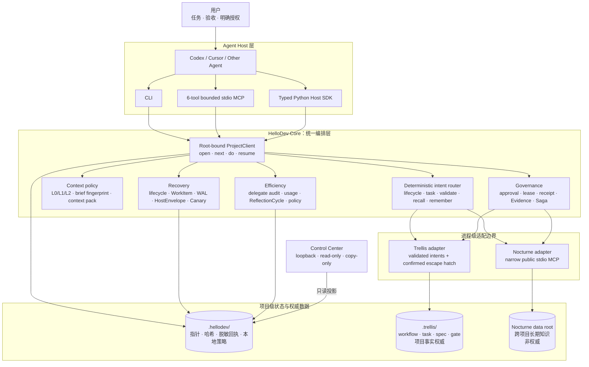
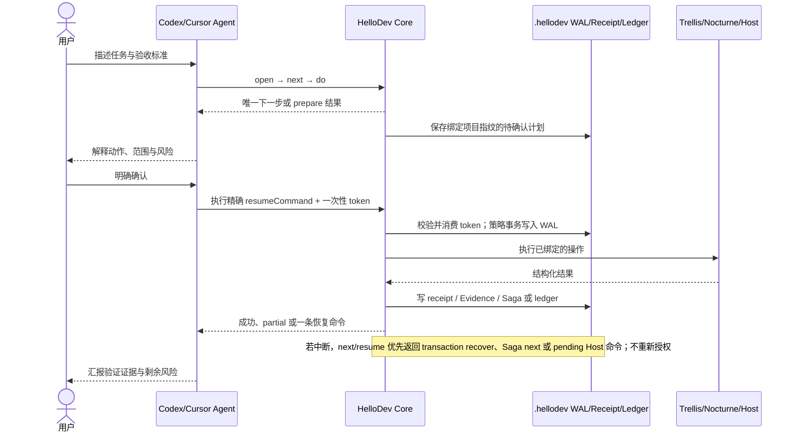

# HelloDev Core 0.21.3：Agent 开发编排与治理框架

HelloDev 是面向 Codex、Cursor、Antigravity 等编码 Agent 的本地开发编排与治理框架。它不替代 Agent 写代码，而是统一任务启动、上下文、验收、授权、验证、跨会话恢复和审计。

## 三分钟了解

HelloDev 解决的不是“再写一个 Agent”，而是让现有 Agent 在日常开发中有统一、可恢复、可审计的工作方式：

```text
日常入口 = HelloDev（onboard -> open -> do begin -> next -> do）
项目事实 = Trellis（可选）
长期经验 = Nocturne（可选、非权威）
代码执行 = Codex / Cursor / Antigravity / 其他 Agent 宿主
```

- `onboard`：幂等写入项目级宿主接入；Core 与 bundle 使用同一入口，不改全局配置。
- `open`：初始化或恢复当前项目。
- `do begin`：创建或选择任务，绑定 WorkItem 与验收条件，并返回有界 Context Plan。
- `next`：综合 lifecycle、任务指针、验收、事务和最近回执，只给一条下一步动作。
- `do`：按确定性意图路由到 lifecycle、Trellis 或 Nocturne，不靠模型猜命令。
- `resume`：跨会话恢复，优先处理未完成事务、HostEnvelope、Canary 或 Saga。
- `.hellodev/`：只保存项目内编排状态、指针、哈希和脱敏回执，不复制记忆或源码正文。

```text
用户：用 HelloDev 完成：<任务>。验收：<标准>。
Agent：onboard -> open -> do begin -> contextPlan -> next -> do -> 测试 -> do finish
```

## 项目与可选组件

| 项目 | 作用 | 是否必需 | 推荐入口 |
|---|---|---|---|
| [HelloDev Core](https://github.com/fate-forever/hellodev) | Agent 开发编排、验收、授权、恢复和审计 | 必需 | 从源码安装 Core；Git clone 不包含其他组件 |
| [Trellis](https://github.com/mindfold-ai/trellis) | 仓库级 workflow、spec、task 和 gate | 可选，规范化项目推荐 | [中文安装指南](https://docs.trytrellis.app/zh/start/install-and-first-task) |
| [Nocturne](https://github.com/Dataojitori/nocturne_memory) | 跨项目长期知识与记忆管理 | 可选，需要经验复用时推荐 | [官方 README](https://github.com/Dataojitori/nocturne_memory/blob/main/README_EN.md) |
| [FastCtx](https://github.com/yc-duan/fastctx) | 可选仓库读取加速器 | 非必需 | HelloDev 原生 Context Plane 可独立工作 |
| [Serena](https://github.com/oraios/serena) | 可选符号级代码理解与重构工具 | 非必需 | HelloDev 只发现能力，不自动安装或连接 |

最常见的组合是 **HelloDev + Trellis**：Trellis 保存可版本化的项目事实，HelloDev 负责把 Agent 的日常入口、验收、授权和恢复统一起来。只有确实需要跨仓库经验复用时再安装 Nocturne。小型或已知文件修改可以只使用 HelloDev Core，甚至直接使用宿主原生工具。

> **安装边界：** HelloDev Core 不会静默安装、升级或修改 Trellis/Nocturne，也不会修改用户级 PATH 或宿主配置。源码模式复用用户已经安装的组件；自包含 bundle 只在对应版本 Release 资产真实存在且校验通过时使用。

## 快速开始

### 先把这段发给 Agent（推荐）

最省心的方式是打开目标项目，直接告诉 Codex、Cursor 或 Antigravity Agent：

```text
用 HelloDev 完成：<任务>。
验收：<测试、行为或交付物>。
```

项目完成一次 `onboard` 并重新加载宿主后，Cursor/Antigravity 项目规则与 HelloDev MCP instructions 会自动提供日常流程；Codex 还会读取仓库现有的 `AGENTS.md`。这些规则引导 Agent 使用 HelloDev，AcceptanceContract、验证快照和 `finish` 门禁负责硬约束受管状态，但 HelloDev 不能充当操作系统沙箱阻止宿主直接运行其他工具。

0.21.3 起，`onboard` 还会安装一个项目级 `hellodev` Skill：Cursor 位于 `.cursor/skills/hellodev`，Codex/Antigravity 位于 `.agents/skills/hellodev`。Skill 让兼容宿主在看到 HelloDev 项目或任务时自动加载精简工作流，并只在故障时继续读取 recovery reference；它不会安装到用户全局目录，也不能替代 MCP/Core 的授权和门禁。

手工等价的最短路径：

```powershell
hellodev --version
hellodev --root . onboard --host <codex|cursor|antigravity>
hellodev --root . open
hellodev --root . do begin --goal "<任务>" --acceptance "<验收标准>"
hellodev --root . next
```

多条、生产式需求应原样保存为项目内 UTF-8 文件，并在开始时绑定，避免 Agent 摘要遗漏验收项：

```powershell
hellodev --root . do begin `
  --goal "<目标>" `
  --acceptance "<测试与交付门禁>" `
  --requirements-file "USER_REQUIREMENTS.md"
```

此后执行 `next.action.hostCommand`，按真实退出状态调用返回的 `recordSuccessCommand` 或 `recordFailureCommand`，最后通过 `hellodev do finish` 受控收尾。不要直接跳 lifecycle，也不要把 Trellis context validation 当成项目测试。

完整安装方式、Agent 执行协议、Trellis/Nocturne 接入、恢复与排错见 **[Quick Start](docs/QUICK_START.md)**。

> **发行事实：** Git 仓库只包含 HelloDev Core 源码，不直接 vendoring Trellis/Nocturne/FastCtx/Serena 或平台运行时。GitHub Release `v0.21.3` 另行提供经过 manifest 与离线 smoke 验证的 Windows x86_64 自包含 bundle、Core wheel、SPDX SBOM、第三方通知、校验和，以及 Trellis/Nocturne 的精确对应源码。本文不宣称 HelloDev 0.21.3 已发布到 PyPI。

<details>
<summary><strong>当前版本与近期演进（0.16.0-0.21.3）</strong></summary>

## 0.21.3：项目级 HelloDev Skill

0.21.3 补齐 Agent 的宿主原生认知入口，同时保留现有确定性控制面：

- Core wheel 内置一个标准 `hellodev` Skill，而不是恢复旧插件的 start/plan/work/check/finish 等十多个碎片 Skill。
- Skill metadata 在 HelloDev 项目、显式 HelloDev 请求、managed task 启动/恢复/验证/收尾时触发；主 `SKILL.md` 只保留日常路径，重复 reasonCode、closure recovery、stale evidence 等故障矩阵按需读取 `references/recovery.md`。
- `onboard --host cursor` 幂等安装到 `.cursor/skills/hellodev`；Codex/Antigravity 安装到 `.agents/skills/hellodev`；`host=none` 不写 Skill，所有路径都限制在目标项目内。
- 隐藏托管摘要记录各 Skill 文件的安装哈希。未修改的旧托管版本可以升级；缺失、损坏、符号链接或用户修改过的 Skill fail closed，且在 `.hellodev`、MCP config、宿主 rule 写入前报告冲突。
- Skill 只指导 Agent 读取规则、调用 `open`、跟随唯一 `nextAction`、记录真实 host result、处理 approval/resume 和停止重复失败。MCP、AcceptanceContract、verification snapshot 与 closure transaction 仍是强制层。

当前证据覆盖 Skill 结构、三宿主路径、幂等安装、托管升级、用户修改保护和 wheel 资源，不据此声明 wall-clock 或 token 提升。

## 0.21.2：可恢复收尾与渐进式 Agent 故障指引

0.21.2 修复 Trellis 收尾的部分提交窗口，并让 Agent 在失败时逐步获得足够但不过量的恢复信息：

- `finish` 在申请授权或修改 Trellis 前先要求 lifecycle 已进入 `checking`。若仍为 `working`，响应只返回唯一 `nextAction`，不会生成 approval，也不会完成原生 task。
- Trellis-backed closure 持久化 `prepared -> native-completed -> lifecycle-finished -> committed` 事务。进程在任一步中断后，`next`/`resume` 会优先恢复事务；已存在的 task-complete operation 与 receipt 不会被重复执行。
- 对 0.20.9-0.21.1 形成的旧部分提交，只在 task、component result 和成功 receipt 唯一且一致时认领；有歧义时 fail closed，不猜测历史记录。
- host verification identity 排除 `.trellis/tasks/*/task.json` 与 task gate 状态，因此任务完成动作不会让刚通过的代码测试过期；任何源码变化仍会使证据失效。
- `agentGuidance` 渐进披露：待授权时只解释确认边界；首次路径错误只给一个修复动作；恢复或重复失败时再给 `next`、`resume`、verbose status 和停止修改、向用户升级的规则。Agent 不应猜测 `done`、复用 token、编辑 `.hellodev` 或绕过 HelloDev 直调 Trellis。

这些变化解决的是一致性和可恢复性，尚无新的 counterbalanced Fresh-Agent A/B，因此 0.21.2 不声明总体耗时或 token 改善。

## 0.21.1：需求到门禁的 Agent 路径收敛

0.21.1 针对 0.20.9 Fresh-Agent 轨迹中“首次门禁较晚、工具调用更多”的事实，减少 Agent 在规划、Trellis 准备和命令衔接上的探索，但不降低验证或授权要求：

- 精确绑定的需求会被确定性投影为有界 `AC-xxx` criterion 与渐进 gate plan；每个 gate 显示 host command、T-level、scope、映射 criterion 和当前 verification 状态。该投影不执行命令、不写验证证据，也不能证明自然语言语义完整。
- `do` 与 executable-acceptance CLI 的成功响应统一携带一个 `nextAction`；待审批响应优先保留精确 `resumeCommand`。它只规范化下一步，不执行命令、不消费 approval token。
- Trellis WorkItem 在 `begin/work` 返回本地只读 preflight，检查复杂任务的 `prd.md`、`design.md`、`implement.md` 与非 seed context manifests；它不能替代 Trellis 原生 validation 或项目质量门禁。
- capability cache 升级为可比较的 schema v2。只有 `.trellis/spec/context/CONTEXT.md` 单独变化时可自动刷新；AGENTS、workflow、scripts、配置、组件运行时或仓库工具变化仍 fail closed，要求显式 review/refresh。
- 每次成功 `do` 返回本地 monotonic `operationMetrics`，用于拆分 Core 调用开销；它不持久化，也不是 Agent 总开发时间、模型时间或 token usage。

这些变化有单元、兼容和发行门禁证据，但尚未完成新的 counterbalanced Fresh-Agent A/B，因此 0.21.1 不声明总体 wall-clock 或 token 提升。

## 0.21.0：确定性动态升阶与可执行验收提案

0.21.0 把“失败后的反思”和“需求到测试”的过程变成可审计状态，而不是依赖 Agent 自述：

- 同一 WorkItem、规范化命令和仓库快照出现一次失败后进入 watching；再次尝试未改变输入时进入 strict，`next` 要求先提交根因与替代策略摘要，再允许继续修改。诊断账本只保存摘要哈希，不保存原始诊断文本，不自动派生 subagent。
- strict 模式建议 T2 验证、减少输出噪声，但不盲目压缩诊断上下文；仓库快照变化后旧升阶自动失效，避免永久锁死。
- 使用 `--requirements-file` 精确绑定需求的任务，在 `do work` 前必须通过 `acceptance propose` 提交测试或 invariant 提案，并由 `acceptance review` 明确批准。提案绑定 cycle、WorkItem、需求哈希、目标文件基线、命令哈希和仓库快照。
- 提案审核不会写测试文件、不会运行 host command，也不会生成 verification evidence；实际测试仍由宿主执行并以 `host-asserted` 回执记录。仅使用一句 `--acceptance` 的小任务保持原有快速路径。

这些是正确性与轨迹治理能力，当前没有新的 Direct-vs-HelloDev A/B，因此不宣称 0.21.0 已带来耗时或 token 改善。

## 0.20.9：验收完整性与原子收尾

0.20.9 修复了 0.20.8 fresh-Agent 生产式评测中发现的两个正确性缺口：

- 复杂需求可通过 `do begin --requirements-file <项目相对 UTF-8 文件>` 无损绑定。HelloDev 在 `.hellodev/acceptance-sources.json` 保存有界原文、SHA-256、字节数和行数；源文件缺失、替换、变化、使用绝对路径或符号链接时 fail closed。
- strict 变更涉及超过十个文件时，Agent 缩短后的 `--acceptance` 摘要不足以收尾，必须提供精确需求来源；小任务和旧项目继续兼容。
- 已绑定 WorkItem 的 lifecycle 不能通过底层命令直接进入 `finished`，统一由 `hellodev do finish` 执行受控收尾。
- Trellis 收尾必须依次确认当前原生任务、成功的 `intent/task-complete` receipt、`completed` 状态、WorkItem 绑定的 `.gates/hellodev-quality.json` 和 `linkedPhase=finished`，最后才提交 lifecycle completion。

HelloDev 无权读取宿主的私有聊天记录。宿主或 Agent 必须把权威需求显式写入项目并传给 `--requirements-file`；这是本地隐私边界，不是隐式抓取聊天内容。

## 0.20.8：实测开销修复

0.20.8 针对生产式 A/B 暴露的流程开销和正确性问题进行了修复，但不把未测量的改动宣称为提速：

- Trellis task-set digest 只包含有效、非符号链接的任务目录，`README.md` 和 `.gitkeep` 不再造成 prepare/run 冲突。
- `do begin` 在实现前返回保守 `closurePlan`；宿主执行其中的 `hostCommand`，变更后 level/scope 仍可收紧。
- Windows 下有界 npm 启动别名（`npm`、`npm.cmd`、`cmd /c npm`）共享证据身份；出现 shell 元字符时禁止这种等价。
- 最多 16 个 host check 可通过重复 `--result-json` 或 PowerShell 安全的 `--result` 原子记录，减少逐条 CLI 往返，同时保持 `host-asserted` 且不保存原始输出。
- 同命令的 `T2/project` 成功只有在 WorkItem 和完整仓库快照不变时，才能覆盖后续 `T1/code` 或 `T1/docs`；精确失败仍会阻止收尾。
- 当前快照 receipt 会刷新 WorkItem；Trellis completion 将 hash-only 证据合并到 `.gates/hellodev-quality.json`，不再与用户维护的质量文件竞争。

0.20.7 及更早版本的完整演进继续保留在下文。

## 0.20.7：Intent-first Bootstrap 与 Strong Closure

0.20.7 修复了 Agent 在新项目中从 `open` 漂移到 `do plan`、原生 Trellis 初始化和无绑定收尾的问题：

- 未绑定的 `open` / `next` 只返回结构化 `begin-work` action，明确要求 `goal` 与 `acceptance`；宿主不需要猜路径、探测 help 或改用原生 Trellis CLI。
- `plan` 必须已有 WorkItem；`work`、`verify`、`check`、`finish` 还必须有绑定到当前 cycle/WorkItem 的 AcceptanceContract，因此不再产生 `workItemId=null` 的日常验证记录。
- `finishPolicy=suggest` 只放宽补充门禁，不再放宽 WorkItem 与 AcceptanceContract 身份；缺绑定、缺验收或验收未满足都会 fail closed。
- Trellis `task-begin` 在一次精确授权下创建或选择任务、进入 `in_progress` 并绑定 WorkItem/AcceptanceContract；operation ledger 支持幂等恢复，不以原生初始化作为 fallback。
- 多个 Trellis 任务只在唯一可靠对齐时自动选择；歧义时返回有界 `candidateActions`，由 Agent 执行一条精确 `do begin --task`。
- Dashboard schema 23 / Control Center 3.3 增加 `workItemBound`、`acceptanceDeclared`、`trellisTaskBound` 与 `closureEligible`，并显示唯一下一步的紧凑 action；页面仍为 GET/copy-only。

这些变化修复的是路径发现、绑定完整性和闭环正确性；相对 Direct Agent 的耗时或 token 收益仍需新的独立顺序 A/B 验证，不能从单元测试推断。

## 0.20.6：Manifest-first Verification Plan

0.20.6 针对真实 TypeScript/Vitest + Trellis 回归中暴露的错误 pytest 选择、多命令验收漏检和失败后 action 冲突做了兼容修复：

- 有效 `package.json` test script 优先于泛化的 `tests/` 目录；Python 需要显式 manifest/config 或有界 `.py` 测试证据，混合显式 runtime 根目录会 fail closed。
- `npm test and npm run typecheck pass` 被投影成有序的两个 host verification step；每次 `next` 只返回一个 action，不拼接 shell 命令，全部步骤都必须覆盖当前 scope snapshot。
- 当前源码变化会让旧步骤证据失效；未变化的失败转为只读诊断，`next` 不再同时返回 `status --verbose` 和可执行的失败命令。
- Trellis context validation 继续单独标记为 `qualityGateSatisfied=false`，不能替代 host test/typecheck；HelloDev 仍不执行命令或保存原始输出。
- Dashboard schema 22 / Control Center 3.2 展示 verification plan 状态，仍保持 GET/copy-only。

以上实现测试只证明行为和兼容性，不代表相对 Direct Agent 的耗时或 token 提升；性能收益仍需同任务、顺序运行的独立 A/B。

## 0.20.5：Adaptive Governance 快路径

0.20.5 针对真实 Codex A/B 轨迹中暴露的 CLI 探路、verification session 往返、重复 usage 扫描和 Nocturne 召回错域做了兼容优化：

- `next.action` 一次返回宿主测试命令以及成功/失败的精确回执命令；`--current-snapshot` 可原子记录当前快照，无需先创建 verification session。旧 session 与 `--snapshot` 路径继续兼容。
- 默认六字段 `open` 和普通 `do` 不再扫描尚未完成的 Codex rollout；精确 token usage 只在 `open --verbose` 或显式 `usage sync` 时采集。Cursor/Antigravity 未提供可信 receipt 时仍报告 `unavailable`，绝不估算。
- Nocturne 技术召回默认使用 `core` domain，并从 `package.json` / `pyproject.toml` 加入有界 runtime 词；零命中只报告诊断，不自动扩大查询或重试。
- Nocturne project namespace 仅是 HelloDev 审计元数据，因为当前上游 `search_memory` 合约没有已验证的 namespace 参数；它不被描述为上游强制隔离。
- Dashboard schema 21 / Control Center 3.1 展示新的 action 与 memory 状态，仍保持 GET/copy-only。

HelloDev 仍不执行测试，原子回执仍是 `host-asserted`，Trellis 最终权威和一次性授权边界均未削弱。0.20.5 的单元测试只证明行为与兼容性；实际耗时和 token 改善必须由同任务、顺序运行的 Direct Agent A/B 复测确认。

## 0.20.4：Guided Acceptance

0.20.4 把 0.20.2 可选的仓库语义能力接入默认 `check` / `finish` 质量路径，解决“生命周期完成但功能实现遗漏”的真实问题，同时不增加新的日常步骤：

- 按验收目标和 ChangeSet 自动选择 `lite / guided / strict`；纯文档保持轻量，普通代码进入 guided，高风险目标、删除、宽改动或宽语义影响进入 strict。
- 显式新增、实现、修复类目标若没有代码变更，会阻止 `check` / `finish`，避免只写流程证据就结单。
- 对当前变更执行有界、只读、Python AST 影响检查；新引入的 override 构造参数未传给基类时 fail closed，可捕获 `HTTPResponse` 接收 `x_security_headers` 却未转发的缺陷。
- ChangeSet v2 保存 hash-only 缺陷基线，只阻止本轮新问题；0.20.2 的 v1 基线仍可读取，缺少质量基线时该项降为 advisory，避免误判历史代码。
- 验证证据继续标注 `host-asserted`，并统计当前 WorkItem 的命令数、快照数和重复命令数；这些指标披露返工，不冒充 provider-signed 结果。
- 默认 `open` 仍恰好六个顶层字段，但现在显示 mode、quality 和 guided blocker；Control Center 3.0 / schema 20 合并展示质量模式、语义阻塞和验证多样性。

HelloDev 仍不执行项目测试、不自动启用 Trellis/Nocturne/Serena、不合并其数据库，也不持久化原始路径、符号或源码。当前 AST 门禁只覆盖可高置信判断的 Python 构造器转发模式，不宣称完整类型系统或调用图。

## 0.20.2：Acceptance-driven Flow

0.20.2 在保留 `hellodev@trellis` 与 `hellodev@nocturne` 协议身份的基础上，把验收条件贯穿恢复、验证、门禁和收尾：

- `do begin --acceptance` 持久化一个有界 AcceptanceContract；它绑定 lifecycle cycle 与 WorkItem，不保存测试输出。
- `next` 优先读取 AcceptanceContract 和 AcceptanceEvidence，而不是只按 lifecycle 硬编码跳转；相同 scope snapshot 的成功证据仍可复用。
- AcceptanceEvidence 统一展示 host test、Trellis context gate、覆盖率和 finish decision。Trellis context 只证明任务结构有效，明确保持 `qualityGateSatisfied=false`。
- verification 明确标注 `executor=host`、项目 `cwd` 与 `environmentHint=project-runtime`；HelloDev 不自动运行或伪造测试。
- 默认 `open` 只返回 `task / phase / blockers / acceptance / next / approval`；完整诊断、usage 同步结果和 resume 投影移到 `open --verbose`、`status --verbose` 与 `resume`。
- recall 先查项目内事实；只有本地信息不足时，才从项目名推导窄域 domain/namespace 和 `limit=3`，建议一次需要原有授权的 Nocturne 外部读取。
- Control Center schema 18 合并展示 lifecycle/Trellis 漂移、验收覆盖率、待执行 host verification 与 memory 状态，仍保持 read-only/copy-only。
- `task-validate` 明确降为 `context-validation`，只检查任务上下文结构，回执类型为普通 command，`qualityGateSatisfied=false`。
- `task-complete` 使用 `operationId`、`expectedDigest` 和一次性授权完成 Trellis task；成功 finish 会清除 current pointer，已完成任务不再被下一轮重复推荐。
- 本地 task 在 finish 后同步标记 completed。默认 `open` 不再附带完整 resume 投影；需要内部诊断时使用 `status --verbose` 或 `resume`。
- `hellodev@trellis` 的结构化写操作继续支持幂等和 digest 冲突保护；增强模式不解析项目生成的 `task.py` 文本输出。
- `hellodev@nocturne` 将每个项目绑定到 hash namespace；update/delete 必须先取得 read receipt，写前重新读取并核对 `expectedVersion`，重复写通过 `operationId` 返回 hash-only 回执。
- Nocturne 返回 `Error: ...` 但错误标志缺失时，HelloDev 仍判定失败，不再生成假成功证据。
- 独立安装的原版 Trellis/Nocturne 保持 compatibility 模式；现有 `.trellis/` 与 Nocturne SQLite 不迁移、不合并，日常命令仍是 `open -> next -> do -> resume`，MCP 仍恰好六个工具。

协议边界、回退行为与许可证说明见 [Component Protocol v1](docs/COMPONENT_PROTOCOL.md)。

## 0.19.7：语义上下文与保守影响分析

0.19.7 将 Serena 值得借鉴的“符号优先”思路内化到 HelloDev，而不复制 Serena 或重写 LSP：

- 明确的 Python 符号查询（如 `ProjectClient.context`）使用依赖零的 AST 定位并只返回目标定义；普通自然语言查询和非 Python 项目继续使用原有词法检索。
- 符号结果沿用 Context Plane 的根目录、敏感文件、字节预算、哈希、游标和无正文持久化边界；持久状态只记录策略与计数。
- Serena 安装仅作为 `available-not-connected` 能力被发现；HelloDev 不读取宿主 MCP 配置、不声称连接成功，也不增加日常 MCP 工具。
- 变更符号被多个 Python 文件引用时，语义影响只能把普通 `T1` 检查升级为 `T2`，不能降低既有验证级别或满足 Trellis gate。

Agent 已知精确符号时可直接请求 `hellodev_context`；小型已知文件修改仍可使用宿主原生精确读取，不要求每次任务都建立 AST 索引。

## 0.19.6：自适应 Trellis 执行

0.19.6 不修改或重发上游 Trellis，而是在 HelloDev 的 `next` 路径中按风险选择一次必要的宿主验证：文档小改使用 `quick/T0`，普通代码使用 `standard/T1`，P0/P1、删除、大改动和安全/迁移/发布等范围升级为 `strict/T2`。项目存在 `scripts/verify.py` 时优先复用其 `fast/full` 契约，否则只建议能够从项目结构确定发现的测试命令。

- 相同命令、scope、WorkItem 与内容快照的成功证据直接标记 `reused-success`，不重复执行。
- 未变化的失败证据会停止机械重跑，要求先诊断或改变相关输入。
- `task.json` 整体读取有 64 KiB 上限，解析后只消费 `priority/scope/status`；不输出或持久化 PRD、描述、路径或源码正文。
- HelloDev 不自动运行宿主测试、不降低确认要求；`do validate` 只证明 Trellis context 合法，交付验收来自当前 AcceptanceContract 的宿主验证证据。

## 0.19.5：HelloDev 前台，Trellis 后台

0.19.5 解决真实使用中“开头使用 HelloDev，后续逐渐退化成直接操作 Trellis”的问题：

- Cursor、Antigravity 与 MCP server 指令要求任务、生命周期、验证和恢复始终经过 HelloDev；`trellis-continue` 统一由 `hellodev resume` 取代。
- 已完成周期发现唯一 Trellis task 时，`next` 返回 `do begin`，不再暴露内部 `work activate`。
- 严格 finish policy 缺少当前 gate evidence 时，Trellis-backed 项目直接推荐 `do validate`，不先把用户带到高级 `gate status`。
- `status --verbose`、`resume` 和 Control Center 2.6 新增只读 facade 投影，展示 HelloDev namespace、已路由 Trellis 回执和可观察的 generic escape hatch 次数；默认 compact status 保持原有 1 KB 上限。
- HelloDev 只能审计经自身执行的 generic Trellis escape hatch；Agent 在外部直接运行 Trellis CLI 对 Core 不可见，因此明确显示 `externalDirectTrellisVisibility=unavailable`，不伪装成完整监控。

Trellis task/spec/gate 仍是仓库权威，HelloDev 不复制其正文、不合并状态机，也不削弱原有审批和验证门禁。

## 0.19.4：端到端效率与召回修复

0.19.4 针对真实多 package 仓库中“检索更慢且可能漏掉跨包事实”的反馈做了兼容优化，不增加命令或 MCP 工具：

- 只有 query 明确包含完整 package identity 时才聚焦子包；普通领域词不再把跨包查询错误锁死在单一 package。
- 排序优先可执行代码和声明，对注释/docstring 重复命中设上限，并加入小范围确定性词干变体。
- `open/status/next/resume` 在单次请求内复用 immutable repository snapshot；空项目或无验证记录时延迟昂贵扫描。
- Codex 历史 usage 回填改为一次锁、一次载入、一次原子写入，保留幂等、冲突拒绝与每 20 回合 ReflectionCycle。
- `hellodev_context` 的预算约束覆盖完整 MCP JSON 响应，不再只约束 snippet 文本；partial 仍只提供一条有界 continuation。

已知符号或已知文件仍应直接使用宿主原生精确搜索/读取；Context Plane 面向陌生仓库和自然语言查询，不接管 `rg/read`。

## 0.19.3：Antigravity 项目级接入

0.19.3 把 Google Antigravity 纳入现有宿主边界，不增加命令或 MCP 工具：

- `hellodev --root . onboard --host antigravity --with-trellis` 幂等合并 `.agents/mcp_config.json`，并生成 `.agents/rules/hellodev.md`。
- 只写项目文件，不修改 `~/.gemini/config/mcp_config.json`；已有冲突的 `hellodev` server 或规则会 fail-closed。
- IDE、CLI 和 SDK 继续看到完全相同的六个 HelloDev MCP 工具；Trellis 初始化保持原生命令，不伪造 Antigravity 专用参数。
- Antigravity/Cursor 没有提交可信 Host SDK usage receipt 时，token/subagent 数据明确为 `unavailable`，也不会误读同目录下旧 Codex rollout。
- 接入后在 Antigravity 中检查 workspace rule 激活设置并重载工作区。

## 0.19.2：更快的按需上下文

0.19.2 针对真实项目中的 Context Plane 延迟做了兼容优化，不增加命令或 MCP 工具：

- 当进程位于项目内的 package/worktree 时，优先扫描该安全子树；否则仅在 query 唯一命中 package marker 时聚焦，歧义时回退项目根。
- 首屏仍执行完整的根目录约束、敏感文件过滤、hash 与来源校验；续页绑定有 TTL、数量、结果数和字节上限的内存结果会话。
- 同一进程内的续页只校验首屏元数据并复用已排序结果，不再重复 walk、读取和排序；进程重启或缓存淘汰后严格重建。
- 仓库内容变化仍会令游标 stale；`.hellodev/` 仍不持久化 query、路径、源码或结果会话。
- 已知文件和小改动仍可跳过 Context Plane，直接使用宿主原生精确读取。

## 0.19.1：可信 Codex 遥测闭环

0.19.1 修复“代码具备反思能力，但真实 Codex/Cursor 使用一直显示 unavailable”的连接问题：

- 自动同步不再强制依赖 `CODEX_THREAD_ID`；缺失时按 HelloDev 项目根目录匹配最近且安全的 Codex rollout。
- 新版 Codex 新增 Token 元数据字段时，使用结构化 JSON 读取所需计数，不再因无关字段扩展而整体失效。
- `open` 和日常 `do` 会增量回填已完成回合；当前未完成回合不会被计入，`next/status/resume` 继续保持只读。
- 只有 `measurement=exact`、`sourceTrust=runtime-observed` 的回执进入每 20 回合一次的确定性 ReflectionCycle；显式导入仍标为较低信任，不参与自动策略反思。
- 状态明确报告选择方式、可信度、已记录数量和距下一周期的回合数；无法获取时仍为 `unavailable`，绝不按字符数估算。
- 仅保存脱敏 Token 计数、时间、数量和哈希回执，不保存 thread/turn/subagent id、session 路径、聊天正文或原始事件。

## 0.19.0：自适应日常编排

0.19.0 不新增命令家族，而是让既有 `begin / next / do / resume` 自动理解项目权威、变更范围和待完成验证：

- `local`：没有 `.trellis/`，HelloDev 本地 task/lifecycle 是权威。
- `trellis-native`：当前 WorkItem 正确指向 Trellis task，Trellis task/spec/gate 是权威，HelloDev lifecycle 只是明确标记的本地投影。
- `hybrid-recovery`：存在 Trellis，但任务指针缺失、歧义或失效；`next` 只给一条恢复命令。
- `do begin` 保存 hash-only ChangeSet 基线；后续只展示 code/docs/project 变更计数，不保存源码路径或正文。

T0/T1 默认绑定 `code` scope，T2 默认绑定 `project` scope。规划会持久化一个 hash-only verification session，宿主执行测试后无需重复命令参数：

```powershell
hellodev --root . do verify --level T1 --command "python -m pytest tests/test_login.py -q"
# 宿主执行声明的测试后，用返回的 session 精确记录：
hellodev --root . do verify --session verification-session-0001 --outcome succeeded --duration-ms 820
```

- 相同命令、相同 WorkItem、相同 scope 快照的成功结果可复用，避免无意义重跑。
- 相同失败结果在相关输入未变化前会阻止机械重试，提示先诊断或修改输入。
- session 绑定 scope、快照、WorkItem 和过期时间；scope 变化、WorkItem 切换、过期或重放都会 fail-closed。
- `.hellodev/verification.json` 仅保存命令哈希、范围快照、结果、耗时和来源标签，不保存命令或输出正文；旧 0.18 `--snapshot` 记录仍兼容。
- `host-asserted` 中间结果始终是建议性证据，不能满足 Trellis gate；最终 `do validate` 仍是权威门禁。

Control Center 2.5 只读展示 project mode、ChangeSet 计数、pending session、T0/T1/T2 和可信耗时累计。它仍不执行命令、不接收 approval token，也不会从任意 Trellis 日志猜测 gate 已完成。

## 0.17.0：统一开始与当前任务

0.17.0 不删除 0.16.0 的命令、状态、六个 MCP 工具或治理能力，而是把首次接入和任务启动收成一条一致路径：

```powershell
hellodev --root . onboard --host cursor
hellodev --root . open
hellodev --root . do begin --goal "修复登录超时" --acceptance "相关测试通过"
```

`begin` 在普通项目创建一个本地任务；发现一个 Trellis 活跃任务时直接选择并建立 pointer-only WorkItem；发现多个时 fail-closed 要求明确 `--task`；需要创建 Trellis task 时仍返回一次性 approval，不绕过上游 workflow。输出只给一个解析后的 `currentTask` 和一个 1200-token 上限的 `contextPlan`。内部 local/Trellis/WorkItem 计数仍保留在高级状态与环境详情中，用于诊断而不是日常心智负担。

Core onboarding 会复用已配置的外部 Nocturne；未配置时明确报告 `configuration-required`，不会猜测启动命令。Control Center 2.3 展示当前任务、唯一下一步、恢复和环境诊断，依旧只读、copy-only，不接收 approval token，也不执行 adapter。

## 0.16.0：原生 Context Plane

HelloDev 把 FastCtx 值得借鉴的“任务驱动、按需读取、稳定续读”思路内化为自己的只读 Context Plane，而不是要求用户再安装或学习一套工具。Agent 仍只面对六个 HelloDev MCP 工具；仓库上下文通过 `hellodev_context` 按任务查询：

```powershell
hellodev context pack --intent code --query "修复登录超时" --scope code --token-budget 1200
```

Context Plane 默认由依赖无关的 `native` 后端提供：

| 契约 | 行为 |
|---|---|
| 任务驱动 | query 提取确定性关键词与中文 bigram，按路径和行命中排序 |
| 预算优先 | 在渲染前应用字节预算，不读取后再无界截断 |
| 可核验来源 | 每段携带相对路径、起止行、文件 SHA-256 与片段 SHA-256 |
| 稳定续读 | continuation cursor 绑定项目根、内容快照、query、scope 与 offset；仓库变化后 fail-closed 为 stale |
| 隐私边界 | `.hellodev/` 只保存扫描数、返回字节数、hash 等 metrics，不保存 query、路径或源码正文 |
| 安全扫描 | 根目录约束、跳过 symlink/敏感文件/依赖与构建目录，并对文件数、单文件和总字节设置硬上限 |

`open/status/resume/doctor/audit` 与 Control Center 共用 Context Plane 状态。它不执行 shell、不替换代码、不启动后台任务，也不取得 Trellis workflow、Nocturne memory 或 approval authority。`.gitignore` 支持的是保守安全子集，不宣称完整复刻 Git 匹配语义。

FastCtx 是独立第三方项目（[yc-duan/fastctx](https://github.com/yc-duan/fastctx)，MIT OR Apache-2.0）。HelloDev 0.16.0 不需要 FastCtx 才能完整工作，也不复制或再分发其源码、二进制、Pdfium 或第三方材料；未来若接入，只能作为 HelloDev-owned contract 后的 **optional accelerator**，不能成为第二个日常入口。

六个 HelloDev MCP 工具的返回值新增 `_hellodevResult`：包含 payload SHA-256、字节数、token 计量来源、预算范围以及结构化 continuation。安装环境提供 `tiktoken/o200k_base` 时记录精确的 HelloDev payload tokens；否则明确标记为保守 UTF-8 字节上界。这只衡量 HelloDev 工具输出，**不代表整轮 Codex/Cursor 对话 token usage**。

</details>

## 核心优势与使用场景

HelloDev 的优势不是重新实现 Trellis 或 Nocturne，而是在二者之上补齐 Agent 日常开发最容易断裂的编排层：

| 优势 | 解决的问题 | 实现方式 |
|---|---|---|
| **统一自然语言入口** | 用户不想记多套 CLI/MCP 语法 | Agent 面向 `open → next → do`，内部确定性路由 |
| **事实与记忆分权** | 长期记忆可能过期、污染或诱导执行 | Trellis/仓库事实优先；Nocturne 仅作辅助建议，不能授权 |
| **可恢复而非重来** | 换聊天、崩溃、部分失败后重复探测和重复授权 | lifecycle、WorkItem、Saga、WAL、HostEnvelope、receipt 与 `resume` |
| **安全可审计** | Agent 可能越权写入或把“建议”当成“已执行” | prepare/approve、一次性 token、typed receipt、evidence gate、drift audit |
| **上下文与成本治理** | Agent 反复读全仓库或滥用 subagent | L0/L1/L2、brief 指纹、context pack、delegate audit、20 回合 reflection |
| **宿主与组件解耦** | Codex/Cursor/CLI 与 Trellis/Nocturne 安装方式不同 | 类型化 ProjectClient、六工具 MCP、Host SDK、进程级 adapters |
| **本地与可移植** | 项目希望本地优先、可离线、可核验 | 项目级状态、portable checkpoint；可选 manifest 校验平台 bundle |

### 特别适合

| 场景 | HelloDev 提供的价值 |
|---|---|
| **跨多个聊天的长任务** | 每次从 lifecycle、当前 WorkItem、未完成 Saga/事务和最近回执恢复，不依赖聊天记忆 |
| **已有 `.trellis/` 的规范仓库** | 继续以 Trellis workflow/task/gate 为权威，同时获得统一入口、上下文预算和 Control Center |
| **多项目经验复用** | 项目事实留在仓库；验证后的跨项目习惯通过 Nocturne 窄域检索与受控沉淀 |
| **Codex 与 Cursor 混合使用** | CLI、ProjectClient 和受限 MCP 共享同一项目状态与授权语义 |
| **复杂或多 Agent 任务** | 委派前审核收益、Agent 数和上下文预算，减少重复灌入与无效并行 |
| **需要审计/恢复的本地研发** | 操作有 receipt，策略事务可恢复，checkpoint 和 drift 可被 Git/CI/Host 外部核对 |
| **固定环境或离线交付** | 在真实发布的 bundle 中固定组件和运行时，同时保持 Trellis/Nocturne 数据面分离 |

### 不必使用或暂不适合

- 几分钟可完成、无需跨会话恢复的单文件小改动；
- 只需要普通 RAG 问答或只需要 Trellis 单仓库 workflow；
- 希望 Agent 无确认地自动写记忆、放宽策略或执行外部写入；
- 需要云端多租户权限中心、远程执行平台或团队级 Web 控制面的场景。

## 安装方式：不要混淆两种发行物

| 方式 | 包含什么 | 适合谁 |
|---|---|---|
| **源码/Core** | HelloDev Python 源码；不含 Trellis、Nocturne 和运行时 | 当前 GitHub 用户、开发者、已有外部组件的用户 |
| **平台 bundle** | HelloDev + 锁定组件 + 独立运行时 + manifest/license/source materials | 希望离线、一体化安装的普通用户；仅在对应 Release 资产真实存在时使用 |

### 源码/Core 安装（当前 GitHub 的可靠路径）

下面是手工等价命令；使用 Agent 时无需自己输入：

```powershell
git clone https://github.com/fate-forever/hellodev.git C:\Tools\hellodev
cd C:\Tools\hellodev
py -3.12 -m venv .venv
.\.venv\Scripts\python.exe -m pip install --upgrade pip
.\.venv\Scripts\python.exe -m pip install -e ".[mcp]"
.\.venv\Scripts\hellodev.exe --version
```

预期版本是 `hellodev 0.21.3`。Python 3.10–3.12 均受源码测试矩阵覆盖。`mcp` extra 用于 Codex/Cursor/Antigravity 的 stdio MCP 接入；只使用 CLI 时可安装 `.`。

在目标项目初始化：

```powershell
cd C:\path\to\your-project
C:\Tools\hellodev\.venv\Scripts\hellodev.exe --root . onboard --host cursor
C:\Tools\hellodev\.venv\Scripts\hellodev.exe --root . open
C:\Tools\hellodev\.venv\Scripts\hellodev.exe --root . do begin --goal "<任务>" --acceptance "<验收标准>"
```

`onboard` 只创建或合并项目级配置；遇到冲突会 fail-closed，不读取或修改全局配置。Codex 使用 `--host codex`。重新加载宿主后即可使用六个有界 MCP 工具：

```text
hellodev_open      hellodev_next       hellodev_do
hellodev_status    hellodev_context    hellodev_resume
```

### 平台 bundle（仅当同版本 Release 资产存在）

从 Release 页面取得与平台匹配的 archive 和 SHA-256，核对后解压到真实目录：

```powershell
Get-FileHash .\hellodev-0.21.3-windows-x86_64.zip -Algorithm SHA256
cd C:\Tools\hellodev-0.21.3-windows-x86_64
.\bin\hellodev.cmd components verify
.\bin\hellodev.cmd setup
cd C:\path\to\your-project
C:\Tools\hellodev-0.21.3-windows-x86_64\bin\hellodev.cmd onboard --host cursor --with-trellis
```

只从 GitHub Release `v0.21.3` 下载同名资产，并先用该 Release 的 `SHA256SUMS` 核对；不要把源码仓库当作 bundle，也不要把旧版本 archive 改名冒充。`components verify` 证明本地字节与随包 manifest 一致，不等于数字签名、远程来源证明或法律审查。

## Trellis 与 Nocturne 如何接入

### Trellis：项目事实与工作流

[Trellis](https://github.com/mindfold-ai/trellis) 负责仓库内可版本化的 workflow、spec、task 和 gate。规范化项目推荐安装；只做轻量任务时不是 HelloDev 的必需依赖。官方中文说明见 [安装与第一个任务](https://docs.trytrellis.app/zh/start/install-and-first-task)。

获得用户明确同意后，可按上游当前公开方式全局安装并核对版本：

```powershell
npm install -g @mindfoldhq/trellis@latest
trellis --version
```

HelloDev 在项目根发现 `.trellis/` 后使用经过验证的意图映射；没有 `.trellis/` 时仍能运行 local lifecycle、Markdown task、context 和治理能力。

```powershell
hellodev trellis status
hellodev trellis intents
hellodev do task list
hellodev do validate --task <trellis-task-directory>  # context structure only
```

源码/Core 不会自行安装、升级或初始化 Trellis。它会复用 PATH 中的 `trellis`/`trellis.cmd` 与项目已有 `.trellis/`；初始化新 `.trellis/` 前必须遵守项目协议并取得用户确认。安装命令和包名以后续上游文档为准。

0.14.1 起，HelloDev 本地任务、Trellis 活跃任务和 WorkItem 指针是三个不同对象：

| 对象 | 保存位置 | 用途 |
|---|---|---|
| HelloDev 本地任务 | `.hellodev/tasks/` | 无 Trellis 时的轻量任务正文 |
| Trellis task | `.trellis/tasks/` | Trellis 权威工作流任务 |
| WorkItem | `.hellodev/state/work-items.json` | 指向本地或 Trellis task，不复制正文 |

上一轮 lifecycle 已 `finished`，且要用既有 Trellis task 开始新周期时：

```powershell
hellodev work activate --trellis-task <task-directory-name>
```

### Nocturne：可选长期知识

[Nocturne](https://github.com/Dataojitori/nocturne_memory) 是可选的跨项目长期知识组件。只有确实需要在多个仓库间复用经验时才推荐安装；具体运行时、依赖和启动方式请以其 [官方 README](https://github.com/Dataojitori/nocturne_memory/blob/main/README_EN.md) 为准。HelloDev 不用一个未经上游验证的通用安装命令替代这些步骤。

Nocturne 是辅助记忆，不能覆盖仓库事实或授权工具调用。获得用户明确同意并按上游文档完成安装后，bundle 模式由 `onboard` 显式启用 bundled Nocturne；源码/Core 模式用项目级外部 stdio 配置：

```powershell
hellodev nocturne configure --command C:\absolute\path\to\nocturne.exe
hellodev nocturne status
```

若实际启动需要 Python 和脚本，可重复传入 `--arg` 并用 `--cwd` 指定工作目录。Agent 应先检查本机实际安装方式，不能猜测路径，也不能静默安装或修改用户级配置。未配置时，`recall` 优雅降级为 local-only。

## 证据门控知识生命周期

0.16.0 不新建第三套记忆数据库。HelloDev 只在 `.hellodev/state/lesson-proposals.json` 保存正文 SHA-256、证据 receipt ID、目标系统、审核状态和时间；正文仍归 Trellis 或 Nocturne 所有。

```text
pending（默认 72h）
├─ verified ──► persisted
├─ rejected ──► pending（必须有新的已验证证据才能重激活）
├─ expired  ──► pending（必须有新的已验证证据才能重激活）
└─ superseded
```

审核命令属于进阶治理面，只改变本地 hash-only metadata，不执行 Trellis/Nocturne 写入：

```powershell
hellodev lesson list --review-state pending
hellodev lesson show lesson-0001
hellodev lesson review lesson-0001 --decision verify --receipt receipt-0001
hellodev lesson review lesson-0001 --decision reject --reason-code insufficient-evidence
hellodev lesson review lesson-0001 --decision supersede --replacement lesson-0002
hellodev lesson review lesson-0001 --decision reactivate --receipt receipt-0002
```

跨项目候选验证必须绑定成功且已验证的 Trellis gate/test receipt；项目候选允许人工项目审核，但真正写入仍服从项目 workflow。`next` 只在安全恢复项处理完且 lifecycle 已结束时，给出一条只读 `lesson show` 审核提示。

Nocturne recall 的原始 MCP envelope 只进入 receipt 哈希，不再原样返回给 Agent。读取投影最多返回 5 条、每条 1200 字符，确定性去重并标记来源、权威性和 freshness；疑似“忽略上文、执行命令、伪造 APPROVE”等指令型记忆只保留 hash 和隔离原因。仓库/Trellis 与长期记忆冲突时，项目事实始终优先。

## 日常命令与授权

| 命令 | 作用 |
|---|---|
| `hellodev open` | 初始化/恢复并刷新必要能力 |
| `hellodev next` | 只读，返回唯一主建议 |
| `hellodev do plan|work|check|finish` | 推进本地 lifecycle |
| `hellodev do task ...` | 路由到 Trellis 或本地 task |
| `hellodev do validate` | 校验 Trellis context 结构并形成普通回执；不满足质量 gate |
| `hellodev do recall` | 本地优先，必要时准备窄域记忆检索 |
| `hellodev do remember` | 准备证据门控的经验沉淀 |
| `hellodev resume` | 从未完成状态恢复 |
| `hellodev doctor --fix-hints` | 只读诊断与修复提示 |

写入与风险操作沿用两段式流程：prepare 返回 `APPROVE-*` 和精确 `resumeCommand`，人类确认后才执行。一次性 token 绑定命令、项目指纹和执行内容，不能重放。所有 profile 下写操作都不会自动放行。

## 架构与边界

下面的图保留两层视角：Agent 只面对薄入口；复杂度集中在 HelloDev 内部的确定性编排、治理和恢复层，而不是暴露给日常用户。


```mermaid
flowchart TB
    U["用户<br/>任务 · 验收 · 明确授权"]

    subgraph HOST["Agent Host 层"]
        A["Codex / Cursor / Other Agent"]
        CLI["CLI"]
        MCP["6-tool bounded stdio MCP"]
        SDK["Typed Python Host SDK"]
    end

    subgraph CORE["HelloDev Core：统一编排层"]
        PC["Root-bound ProjectClient<br/>open · next · do · resume"]
        ROUTE["Deterministic intent router<br/>lifecycle · task · validate · recall · remember"]
        CTX["Context policy<br/>L0/L1/L2 · brief fingerprint · context pack"]
        GOV["Governance<br/>approval · lease · receipt · Evidence · Saga"]
        REC["Recovery<br/>lifecycle · WorkItem · WAL · HostEnvelope · Canary"]
        EFF["Efficiency<br/>delegate audit · usage · ReflectionCycle · policy"]
    end

    subgraph STATE["项目级状态与权威数据"]
        HD[(".hellodev/<br/>指针 · 哈希 · 脱敏回执 · 本地策略")]
        TR[(".trellis/<br/>workflow · task · spec · gate<br/>项目事实权威")]
        NO[("Nocturne data root<br/>跨项目长期知识<br/>非权威")]
    end

    subgraph ADAPTERS["进程级适配边界"]
        TA["Trellis adapter<br/>validated intents + confirmed escape hatch"]
        NA["Nocturne adapter<br/>narrow public stdio MCP"]
    end

    UI["Control Center<br/>loopback · read-only · copy-only"]

    U --> A
    A --> CLI
    A --> MCP
    A --> SDK
    CLI --> PC
    MCP --> PC
    SDK --> PC
    PC --> ROUTE
    PC --> CTX
    PC --> GOV
    PC --> REC
    PC --> EFF
    ROUTE --> TA
    ROUTE --> NA
    GOV --> TA
    GOV --> NA
    PC --> HD
    REC --> HD
    EFF --> HD
    TA --> TR
    NA --> NO
    UI -->|"只读投影"| HD
```

风险操作把“建议、授权、执行、验证”拆成不同状态。以下以策略事务为例；Trellis/Nocturne 写操作沿用同样的一次性授权与 receipt 边界，并在跨系统时由 Saga 串联：


```mermaid
sequenceDiagram
    actor User as 用户
    participant Agent as Codex/Cursor Agent
    participant HD as HelloDev Core
    participant State as .hellodev WAL/Receipt/Ledger
    participant Adapter as Trellis/Nocturne/Host

    User->>Agent: 描述任务与验收标准
    Agent->>HD: open → next → do
    HD-->>Agent: 唯一下一步或 prepare 结果
    HD->>State: 保存绑定项目指纹的待确认计划
    Agent-->>User: 解释动作、范围与风险
    User->>Agent: 明确确认
    Agent->>HD: 执行精确 resumeCommand + 一次性 token
    HD->>State: 校验并消费 token；策略事务写入 WAL
    HD->>Adapter: 执行已绑定的操作
    Adapter-->>HD: 结构化结果
    HD->>State: 写 receipt / Evidence / Saga 或 ledger
    HD-->>Agent: 成功、partial 或一条恢复命令
    Note over HD,State: 若中断，next/resume 优先返回 transaction recover、Saga next 或 pending Host 命令；不重新授权
    Agent-->>User: 汇报验证证据与剩余风险
```

稳定边界：

1. 不 import、复制或合并 Trellis/Nocturne 的数据面；适配器通过进程/CLI/MCP 调用。
2. `.trellis/` 是项目事实，Nocturne 只提供建议性长期知识。
3. 建议、授权、执行、验证是不同状态；记忆不能授权。
4. receipt、WorkItem、Lesson 和 Evidence 默认只保存指针、哈希与脱敏元数据。
5. token 只有宿主提供可信回执时才记录；不可用时保持 `unavailable`，不估算伪精确值。
6. Control Center 是 loopback、只读、copy-only 页面，不执行 adapter。

## 可靠性与效率能力

- **事务 WAL**：策略 token consume → receipt → ledger 可幂等恢复，不重新授权。
- **Host SDK**：类型化 Python client、JSON Schema 和协议协商，避免手拼 HostEnvelope。
- **Canary Evaluation v2**：比较成功率、重试、委派与预算；证据不足拒绝 commit。
- **portable checkpoint**：导出并校验 policy ledger head，便于 Git/CI/外部 Host 保存。
- **20 回合反思**：仅对 `runtime-observed + exact` 回执形成不重叠 ReflectionCycle，并在 `next/status` 给一条节省建议。
- **delegate audit/plan/pack**：先审计是否值得委派，再给共享摘要与角色增量预算；HelloDev 本身不 spawn Agent。
- **L0/L1/L2 context**：按意图确定性建议加载级别，brief 指纹仅在关键文件变化后失效。

进阶命令通过 `hellodev --help-all` 查看。Host SDK 示例见 [examples/host_sdk_minimal.py](examples/host_sdk_minimal.py)，本地零上游 Demo 见 [examples/minimal](examples/minimal/README.md)。

## Control Center

```powershell
hellodev dashboard start
hellodev dashboard status
hellodev dashboard stop
```

Control Center 3.3 默认先回答“当前任务是什么、阻塞是什么、唯一下一步是什么”，并合并展示绑定完整性、HelloDev/Trellis 状态漂移、验收覆盖率、guided quality、验证多样性、待执行 host verification 与 memory 状态；其余统一门面状态、内部任务计数、恢复中心、知识生命周期、Recall 回执、宿主兼容性、Context Plane metrics、语义检索策略、效率和审计摘要按需披露。它使用短时请求缓存、ETag/304、隐藏页暂停轮询与有界列表；不会展示 Context Plane query、符号名、path 或源码正文，不会在浏览器中执行命令或接收 approval token，复制出的命令仍回到 Agent/终端并遵守授权协议。

## 开发与验证

```powershell
python scripts/verify.py --scope fast
python scripts/verify.py --scope full
python -m build
```

`fast` 用于日常相关回归；`full`、wheel smoke、版本/文档/manifest 对齐是发布门禁。CI 不自动发布；PyPI workflow 仅响应受保护的 GitHub Release `published` 事件。

## 更早版本摘要

- **0.15.0**：可选仓库工具 Provider、只读 FastCtx 发现、Provider-aware status/resume/doctor/audit、MCP payload token/哈希计量与结构化 continuation，以及 Control Center 2.1；native 始终可降级，FastCtx 不自动安装、注册或授权。
- **0.14.4**：Control Center 2.0 将 NOW、严格恢复优先级、可筛选 LessonProposal、历史 Recall 回执、环境兼容性与效率摘要收敛为只读交互页面；新增 ETag/304、短时请求缓存、隐藏页暂停轮询和有界分页，不增加网页执行面。
- **0.14.3**：证据门控 LessonProposal 审核生命周期、72 小时 TTL、新证据重激活、聚合 receipt、`next` 审核提示，以及去重/限长/来源标记/指令隔离的 Nocturne recall 投影；不增加记忆数据库或自动外部写入。
- **0.14.2**：Agent-first README/Quick Start，明确源码与 bundle 边界，统一版本/manifest/dashboard；不增加新运行时行为。
- **0.14.1**：任务连续性、三类任务计数、显式 `work activate` 与 Windows 路径边界修复。
- **0.14.0**：manifest 驱动的一体化 bundle、bundled Trellis/Nocturne、数据隔离和显式 onboarding。
- **0.13.0**：类型化 `ProjectClient`、六工具 MCP gateway、渐进式 CLI。
- **0.12.x**：事务恢复、Host SDK、Canary v2、checkpoint、CI/OSS polish。
- **0.8–0.11**：统一意图、上下文分级、WorkItem/Lesson/Evidence、token/subagent 反思与 tighten-only policy。

## 当前限制

- Git clone 只获得 Core 源码；不会自动带上或安装 Trellis/Nocturne。
- 自包含 bundle 目前是独立发布流程，平台、版本和 SHA-256 必须精确匹配。
- Nocturne namespace 能力取决于其公开 MCP；HelloDev 不绕过上游接口。
- Trellis 的未知命令通过显式 escape hatch 使用，不保证全部上游参数自动映射。
- 精确 chat token 取决于宿主回执；当前回复生成完成前无法获得其最终消耗。
- 本项目未把本地哈希链描述为不可篡改账本，也不提供代码签名或法律意见。

## 文档

- [架构与迭代解析](docs/HELLODEV_ARCHITECTURE_EVOLUTION_ZH.md) — 0.1.0 至 0.21.3 的分层架构、实现原理与测试作用
- [Quick Start](docs/QUICK_START.md) — Agent-first 安装、接入、日常使用与排错
- [Release checklist](docs/RELEASE.md) — 版本门禁、wheel/bundle 与发布边界
- [Why HelloDev](docs/WHY_HELLODEV.md) — 项目定位与取舍
- [Case Study](docs/CASE_STUDY.md) — 真实使用记录
- [Contributing](CONTRIBUTING.md) — 开发与贡献约定

## License

HelloDev Core 使用 [MIT License](LICENSE)。Trellis、Nocturne、Python、Node.js 和第三方依赖保留各自许可证；平台 bundle 必须分别附带 notices、licenses、source materials、SBOM 和 component lock。仓库中的 lock/哈希用于可复核分发，不替代独立合规审查。
