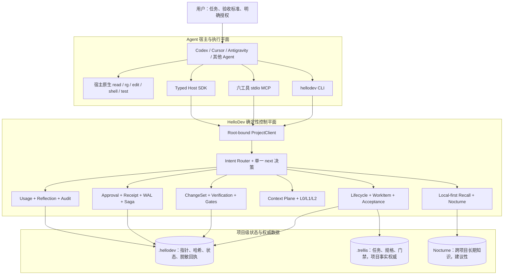
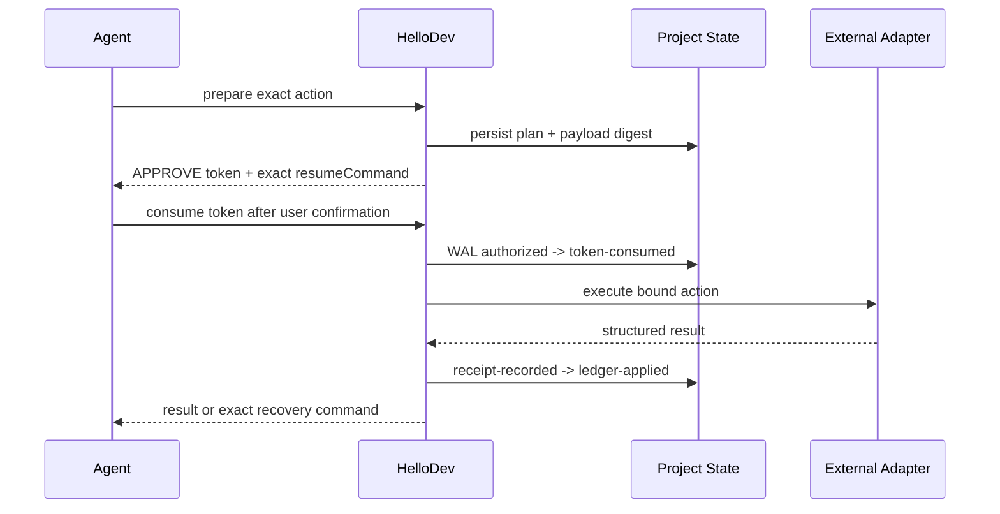

# HelloDev Core 架构与迭代解析

版本范围：0.1.0 - 0.21.3
当前实现：0.21.3
证据基准：当前源码、`docs/ai/` 架构地图、开发进度账本、隔离 wheel 验证和已审计 A/B 记录

## 1. HelloDev 到底是什么

HelloDev 不是新的代码生成模型，也不是 Trellis、Nocturne 或 Serena 的替代品。它是位于 Agent 宿主与项目工具之间的本地编排和治理控制平面。

它解决的是 Agent 开发中的五类系统问题：

1. **连续性**：换会话、进程中断或任务切换后，如何恢复当前任务、阶段、阻塞和下一步。
2. **一致性**：生命周期、Trellis task、验收条件和验证证据如何保持同一个任务身份。
3. **安全性**：风险操作如何做到精确授权、一次消费、失败留痕和中断恢复。
4. **上下文效率**：如何按需提供有限、可追溯的代码上下文，而不是无界读取仓库。
5. **可验证性**：如何区分“Agent 声称完成”“测试执行成功”“Trellis 结构有效”和“任务真的允许收尾”。

因此，HelloDev 的核心价值不是替 Agent 写代码，而是把 Agent 的一次开发过程变成一个可恢复、可审计、可约束的状态机。

## 2. 当前总体架构



这套架构有三个关键分离：

- **执行权分离**：项目命令由宿主 Agent 执行，HelloDev 只规划并记录结果，不假装自己运行了测试。
- **数据权威分离**：Trellis 保存项目事实，Nocturne 保存建议性长期知识，HelloDev 只保存编排状态和绑定关系。
- **授权与结果分离**：审批 token 只允许执行一个精确操作；执行结果必须另行生成 receipt，授权本身不等于成功。

## 3. 核心架构层

### 3.1 宿主接入层

入口包括 CLI、可选的官方 MCP SDK stdio server 和 Typed Python Host SDK。三者最终汇入同一个 `ProjectClient`，所以不会形成三套行为不一致的业务实现。

MCP 面固定为六个工具：

- `hellodev_open`
- `hellodev_next`
- `hellodev_resume`
- `hellodev_status`
- `hellodev_context`
- `hellodev_do`

原理是用少量稳定工具承载版本演进，把变化放在结构化参数、结果和内部策略里。这样 Codex、Cursor 和 Antigravity 的接入协议不会随着每个新功能持续膨胀。

MCP 请求和结果都有字节上限，未知字段会被拒绝；`open` 和 `do` 使用进程内写锁，避免同一 server 内并发修改项目状态。

### 3.2 应用门面与确定性路由层

`application.py` 的 `ProjectClient` 是根目录绑定的应用门面。核心日常流程是：

```text
onboard -> open -> do begin -> contextPlan -> next -> do -> host verification -> check -> finish
                                     中断时 -> resume
```

路由不是由模型自由生成命令，而是根据当前持久状态确定性计算。`next` 在任意时刻只暴露一条主要动作，优先级大致是：

```text
未完成事务
-> pending HostEnvelope
-> 未完成 Saga
-> 失效 WorkItem / 能力指纹
-> 缺失 begin/acceptance 绑定
-> 待执行验证
-> acceptance/gate blocker
-> lifecycle 下一阶段
-> 可选效率建议
```

这降低了 Agent 在 `help/status/gate/receipt` 之间探路，以及同时看到多个相互冲突命令的概率。

### 3.3 生命周期、WorkItem 与任务身份

生命周期描述阶段：`new -> started -> planned -> working -> checking -> finished`。但阶段本身不是完整任务身份。

WorkItem 负责把以下对象绑定起来：

- HelloDev lifecycle cycle
- 本地 task 或 Trellis task 指针
- 当前阶段
- 任务/能力指纹
- AcceptanceContract
- verification 和 gate evidence

WorkItem 只保存指针与哈希，不复制 Trellis PRD 或任务正文。这避免了 HelloDev 和 Trellis 各有一份可独立修改的“事实”。

### 3.4 Acceptance-driven Flow

AcceptanceContract 把验收条件绑定到具体 cycle 和 WorkItem。0.20.9 的 schema v2 进一步允许通过 `--requirements-file` 绑定原始需求文件的：

- 项目相对路径
- UTF-8 文本
- SHA-256
- 字节数
- 行数

这里解决的是“Agent 在 begin 时把复杂需求概括短了，后面所有测试都只验证缩短后的标准”这一类要求丢失。

对于超过十个文件的 strict 变更，只有简短 `--acceptance` 不足以收尾，必须提供精确 requirements source。源文件缺失、内容变化、使用绝对路径或符号链接都会 fail closed。

AcceptanceEvidence 聚合四种不同证据，但不混淆权威：

1. host test/typecheck/build 结果
2. Trellis context validation
3. guided semantic quality
4. finish gate decision

Trellis context validation 只能证明任务结构和上下文有效，始终明确 `qualityGateSatisfied=false`，不能冒充测试通过。

### 3.5 ChangeSet、验证和门禁

`do begin` 捕获 hash-only ChangeSet 基线。后续状态只暴露代码、文档和项目范围的变更计数与快照，不持久化源码正文。

验证身份由以下字段共同确定：

```text
WorkItem + command hash + T-level + scope + scope snapshot + repository snapshot
```

只有身份仍一致的成功证据才能复用。源码变化会使旧证据失效；相同失败在输入未变化时不会机械重跑，而是要求先诊断或修改代码。

T0/T1/T2 的作用是按风险控制验证范围：

- `T0`：文档或极小改动的快速检查
- `T1`：普通代码变更，通常绑定 code scope
- `T2`：安全、迁移、删除、大范围或高语义影响变更，绑定 project scope

HelloDev 返回 `executor=host`、规范化 `cwd`、runtime hint、待执行命令以及成功/失败回执命令。宿主执行后，HelloDev 记录 `host-asserted` 结果。它不保存测试原始输出，也不把 host assertion 冒充 provider-signed evidence。

### 3.6 Trellis 组件边界

Trellis 是可选的项目事实与工作流后端。存在有效 Trellis WorkItem 时：

- Trellis task/spec/gate 是权威数据。
- HelloDev lifecycle 是明确标注的本地投影。
- HelloDev 不复制任务正文，不合并两套状态机。
- 写操作必须经过一次性授权和 receipt。

0.20.0 后，bundle 内的增强 Trellis 通过 `hellodev.component/v1` 和结构化 bridge 执行 list/current/create/show/start/validate/complete，不再解析项目生成脚本的自由文本输出。操作使用 `operationId`、任务摘要和 `expectedDigest` 实现幂等重放与并发冲突拒绝。

0.20.9 收尾时必须同时满足：

1. 当前 Trellis task 仍存在且身份匹配。
2. `intent/task-complete` receipt 成功。
3. Trellis task 已到 `completed`。
4. WorkItem 绑定的 `.gates/hellodev-quality.json` 通过。
5. WorkItem 已刷新到 `linkedPhase=finished`。
6. 最后才允许 lifecycle 提交 `finished`。

这不是跨文件数据库 ACID，但通过可恢复顺序和幂等操作避免了 0.20.8 出现的“任务已归档、WorkItem 仍 working、lifecycle 却 finished”的分裂状态。

### 3.7 Nocturne 知识边界

Nocturne 只在本地信息不足时用于窄域召回。HelloDev 从项目 manifest 推导有限的 runtime 词和默认 `core` domain，默认 `limit=3`，零命中不自动扩大范围或无限重试。

增强 Nocturne 协议把项目根映射为审计 namespace hash。读取成功后生成不含正文的 read receipt；update/delete 必须重新读取目标并检查 `expectedVersion`。写操作使用 `operationId` 形成 hash-only 幂等回执。

Nocturne 内容不能授权操作，不能满足 Trellis gate，也不会被复制进 `.hellodev/`。

### 3.8 Context Plane

Context Plane 是依赖零的本地只读检索层，而不是对 `rg/read` 的强制替代。

词法路径包括：

- 根目录约束和符号链接拒绝
- 敏感文件、依赖目录、构建目录过滤
- 普通词和 CJK bigram 排名
- 文件数、字节数和输出预算
- path/line/file hash/snippet hash provenance
- 与项目、快照、query、scope 和 offset 绑定的游标

语义路径只对明确的 Python 符号查询启用标准库 AST，返回目标定义；自然语言、非 Python 或解析失败时回退词法检索。语义影响只能把验证从 T1 升级到 T2，不能降低门禁。

重要边界是：已知文件或已知符号的小改动应直接使用宿主原生 `rg/read`。Context Plane 主要服务陌生仓库和模糊自然语言查询。

### 3.9 授权、回执、WAL 与 Saga

高风险动作采用 prepare/consume 两阶段授权：



token 与 root、payload、可执行文件身份、风险类型和计划绑定，只能使用一次。授权记录不保存原始 token。

事务 WAL 用于一个治理动作内部的中断恢复；Saga 用于 Trellis 与 Nocturne 等无法原子提交的跨系统序列。两者都不会把失败静默吞掉，也不会因为恢复而要求重复授权。

### 3.10 Usage、Reflection 与治理优化

HelloDev 只在能够读取完整 Codex turn 边界时计算精确本地 runtime delta。当前正在生成的回复没有完成边界，无法计入；Cursor/Antigravity 没有可信 receipt 时必须保持 `unavailable`。

每 20 个 `runtime-observed + exact` receipt 形成一个不重叠 ReflectionCycle。它只做确定性聚合和 allowlisted 建议，不调用模型，不自动修改安全策略。

这里的 `exact` 表示对本地已完成 Codex 事件计数做确定性差分，不表示 provider 签名、计费真实性或价格证明。

### 3.11 Control Center 与发行边界

Control Center 是 loopback、token-bound、GET/copy-only 的只读投影。它可以显示 lifecycle/Trellis 漂移、acceptance coverage、pending verification、memory 和 usage 状态，但没有执行 adapter 或消费 approval token 的 API。

Core wheel 是 MIT、`py3-none-any`、基础依赖为零；MCP 是可选 extra。统一 Windows bundle 将 Python、Node、Trellis、Nocturne 与许可证材料放入独立发行物，但不改变各组件许可证和数据所有权。

## 4. 项目状态模型

`.hellodev/` 中的主要状态可以按职责分为：

| 类别 | 代表文件 | 作用 |
|---|---|---|
| 项目与任务 | `config.json`、`tasks/`、`work-items.json` | 项目配置、本地 task、外部任务指针 |
| 流程 | `lifecycle.json`、`acceptance.json`、`acceptance-sources.json` | cycle、阶段、验收与原始需求完整性 |
| 变更与验证 | `changeset.json`、`verification.json`、`acceptance-evidence.json` | 快照、host assertion、验收覆盖 |
| 授权与审计 | `approvals.json`、`receipts.json`、`transactions.json` | 一次性授权、执行回执、WAL |
| 跨系统恢复 | `sagas/`、`host-envelopes.json`、`host-completions.json` | Saga 和外部 Host 恢复 |
| 上下文与能力 | `capabilities.json`、Context metrics | 组件指纹和无正文检索指标 |
| 效率治理 | `usage-receipts.json`、`reflection-cycles.json`、`optimization.json` | 已完成 turn 统计和非权威建议 |

这些文件普遍采用原子临时文件替换、严格 schema、项目根解析和符号链接拒绝。多个关键 store 还有进程内与跨进程锁。

## 5. 架构迭代总览

| 阶段 | 版本 | 核心主题 | 架构结果 |
|---|---|---|---|
| 独立内核 | 0.1.0 | 从插件中抽出 Core/CLI | 建立项目级状态和可独立 wheel |
| 外部工具治理 | 0.2.0-0.4.0 | Trellis/Nocturne、receipt、Saga、知识策略 | 建立进程边界、审计和恢复 |
| Agent 治理与可视化 | 0.5.0-0.7.0 | delegation、usage、Control Center、日常入口 | 从底层工具变成可日常使用的控制面 |
| 连续性与渐进披露 | 0.8.0-0.10.1 | F1/F2、恢复、优化建议、隐藏高级能力 | 降低日常认知负担并保留高级治理 |
| 可靠性闭环 | 0.11.0-0.12.1 | HostEnvelope、policy、WAL、checkpoint、精确 usage | 建立可恢复、可验证的策略演进 |
| 宿主与发行 | 0.13.0-0.15.0 | MCP、统一 bundle、repository providers | 接入多宿主并稳定发行边界 |
| 上下文与统一体验 | 0.16.0-0.19.7 | Context Plane、begin、progressive verification、语义分析 | 从“会编排”走向“懂当前项目状态” |
| 原生组件与验收闭环 | 0.20.0-0.20.9 | Component Protocol、Acceptance、质量门禁、性能与原子收尾 | 解决真实 Agent 测试暴露的错配和 false-green |
| 可执行验收、恢复与 Agent 认知 | 0.21.0-0.21.3 | Dynamic Escalation、Acceptance Planning、Recoverable Closure、项目级 Skill | 把异常恢复协议从长提示词变成宿主可发现、Core 可强制的分层路径 |

## 6. 各版本迭代：作用、原理与测试表现

### 0.1.0：Standalone Core MVP

**作用**：把 HelloDev 从历史 Codex plugin 参考实现中抽离，形成独立 Python Core/CLI。
**原理**：以项目根和 `.hellodev/` 为边界，提供初始化、本地 task、状态和 snapshot。
**测试表现**：7/7 单元测试通过，wheel 在全新虚拟环境完成安装和基础 task 流程。该阶段证明“可独立运行”，没有效率 A/B。

### 0.2.0：Trellis 与 Nocturne Adapter

**作用**：让 HelloDev 能治理项目工作流和长期知识，但不导入上游源码。
**原理**：Trellis 走受控命令，Nocturne 走 public stdio MCP；读写行为区分风险并绑定一次性 token。
**测试表现**：9/9，通过 fake MCP 的读、写和 token replay 测试；本机最小 live check 验证 Trellis 0.6.7 与 Nocturne 七工具发现。没有证明开发提速。

### 0.3.0：Lifecycle、Receipt 与 Saga

**作用**：把“命令调用”升级为可恢复流程。
**原理**：生命周期记录阶段；receipt 保存结构化执行结果；Saga 串联 Trellis 写、验证和 Nocturne 写。
**测试表现**：13/13，完整模拟跨组件序列。证明恢复和审计正确性，不代表 Saga 在真实项目中已频繁触发。

### 0.4.0：Intelligence Policy

**作用**：区分项目事实与跨项目经验，避免记忆污染权威数据。
**原理**：确定性分类和窄域 recall/remember plan；外部写仍是 prepare-only。
**测试表现**：14/14。主要验证分类和权限边界。

### 0.5.0：Delegation 与 Usage Governance

**作用**：在委派 Agent 和讨论 token 优化之前先建立审计口径。
**原理**：delegate plan/pack 只给共享摘要和角色增量；usage 只接受明确来源，不把估算包装成真实值。
**测试表现**：15/15。没有真实宿主 receipt 时仍不能得到可靠 token。

### 0.6.0：Control Center

**作用**：将分散的 lifecycle、capability、receipt、usage 状态集中展示。
**原理**：loopback server + token cookie，只读 API，页面只能复制命令。
**测试表现**：16/16，并验证 start/status/stop、未授权 401 和无执行 API。它改善可观察性，不直接减少 Agent 步骤。

### 0.7.0：P0 日常使用基线

**作用**：形成稳定的 `open -> next -> do` 日常入口。
**原理**：将本地 lifecycle、Trellis 路由、context level 和授权计划投影为单一下一步。
**测试表现**：31/31，并在真实 Trellis 元数据副本上走通初始化、开始、brief 和 task list。此阶段仍偏工具化。

### 0.8.0：F1 Seamless Experience

**作用**：减少 profile、授权和 adapter 细节暴露给日常 Agent。
**原理**：统一 `do` 入口，根据 strict/trusted-local/autopilot-read 决定 token、lease 或自动读取。
**测试表现**：68/68，真实 Trellis strict/trusted-local/validate 流程通过。证明行为统一，没有独立 Agent A/B。

### 0.9.0：F2 Continuity

**作用**：增强跨会话、跨进程和跨组件连续性。
**原理**：pointer-only WorkItem、EvidenceLink、LessonProposal 和 Saga 共同绑定任务指纹。
**测试表现**：fast 72、full 104，通过 Trellis + disposable Nocturne continuity matrix。主要收益是可恢复性。

### 0.10.0：Optimization Advisor

**作用**：在不让框架自行改策略的前提下，形成反思与优化建议。
**原理**：DecisionTrace、ReflectionReport 和 tighten-only proposal 全部是确定性、allowlisted、非自执行状态。
**测试表现**：fast 82、full 114。证明建议不会越权，不证明建议提高开发效率。

### 0.10.1：Progressive Disclosure

**作用**：防止高级治理信息淹没日常流程。
**原理**：日常、恢复、高级命令分层；效率 hint 只能附加在 finished 状态，不改变主要 `next`。
**测试表现**：fast 87、full 119；验证输出边界和旧流程兼容。

### 0.11.0：Closed-loop Evolution

**作用**：把外部 Host 执行、结果回传和策略演进连接成可审计闭环。
**原理**：HostEnvelope 绑定 root、context、WorkItem、policy、预算和过期时间；Canary 只允许收紧两个安全参数，commit/revert 各需独立授权。
**测试表现**：fast 113、full 145，覆盖并发、过期、canary 和 tamper rejection。没有自动执行 Agent 或策略。

### 0.11.1：真实 Codex Completed-turn Usage

**作用**：从“人工报告 token”推进到“读取已完成 Codex runtime 事件”。
**原理**：用 turn start/complete 边界计算累计计数差，并递归聚合已完成 subagent；只保存计数和哈希。
**测试表现**：fast 113、full 157，并在真实历史 turn 上采到 root/subagent 精确本地计数。它仍不是 provider-signed billing receipt。

### 0.11.2：20-turn ReflectionCycle

**作用**：让可信 usage 数据形成长期效率反馈。
**原理**：按插入顺序每 20 个 receipt 固定分窗、不可重叠，确定性计算 cache/subagent/retry 信号。
**测试表现**：full 171；isolated open/sync 形成 3 个 cycle 和 2 个 pending receipt。只证明闭环可工作。

### 0.12.0：WAL、Host SDK 与 Checkpoint

**作用**：补强“token 已消费但 receipt 或 ledger 尚未落盘”的崩溃窗口。
**原理**：append-only transaction WAL 记录 `authorized -> token-consumed -> receipt-recorded -> ledger-applied`；typed Host SDK 和 JSON Schema 固化外部宿主合约；checkpoint 允许外部保留 ledger head。
**测试表现**：focused 44、full 181，逐阶段注入中断并验证不重复授权或幂等恢复。

### 0.12.1：Reliability 与 OSS Polish

**作用**：补齐多进程恢复、类型发布、CI 和公共文档。
**原理**：共享锁使并发恢复收敛；PEP 561、严格 checkpoint、GitHub Actions 跨平台矩阵提高可交付性。
**测试表现**：focused 48、full 191；后续公开 CI 在 Linux/Windows Python 3.10/3.12 全绿。

### 0.13.0：Agent-native MCP

**作用**：让 Codex/Cursor 等宿主通过标准 MCP 使用同一业务门面。
**原理**：六个 root-bound、closed-schema、bounded-result 工具映射到 ProjectClient；base Core 保持依赖零。
**测试表现**：fast 167、full 199，官方 `mcp==1.28.1` stdio 初始化、list 和调用 smoke 通过。

### 0.14.0/0.14.1：统一发行与任务连续性

**作用**：提供可离线验证的 Windows x86_64 自包含发行物，并保持 Core、Trellis、Nocturne 的独立身份。
**原理**：manifest、组件锁、SHA-256、SBOM、licenses、source materials、reparse/path/collision 检查；bundle runtime 与开发源码完全分离。
**测试表现**：0.14.0 full 215，并通过 poisoned PATH、Unicode 路径、重复 setup、六工具 MCP 和七工具 Nocturne smoke。收益是部署可靠性，不是编码速度。

### 0.15.0：Repository Tool Providers

**作用**：允许原生 read/grep/glob 或外部 FastCtx 在同一有界合约后提供仓库信息。
**原理**：provider 只负责读取，不取得 workflow、memory、approval 或 verification 权威；native 始终可回退。
**测试表现**：fast 188、full 228。FastCtx 被标记为可选 host-managed accelerator，而非默认依赖。

### 0.16.0：Native Context Plane

**作用**：在没有 FastCtx 时仍提供有界、可追溯的仓库上下文。
**原理**：依赖零词法检索、CJK bigram、预算前过滤、hash provenance、快照游标和隐私化 metrics。
**测试表现**：fast 196、full 236；分页 3+2 无重叠、mutation 后 cursor stale、敏感文件过滤通过。后续实测也暴露全仓扫描和续页重复计算问题，推动 0.19.2/0.19.4。

### 0.17.0：Unified Begin

**作用**：把 local task、Trellis task 和 WorkItem 的启动收敛为 `do begin`。
**原理**：唯一任务自动选择；多个候选 fail closed；一次调用创建/选择任务、绑定 WorkItem、进入 planned 并返回 1200-token Context Plan。
**测试表现**：fast 203、full 243；isolated wheel 走通空项目 `onboard -> open -> begin -> status`。

### 0.18.0：Progressive Verification

**作用**：防止旧测试结果在代码变化后继续被当作有效证据。
**原理**：T0/T1/T2 结果绑定 command hash、repository snapshot 和 WorkItem；不变成功可复用，不变失败阻止机械重跑。
**测试表现**：fast 209、full 249；isolated smoke 验证 record/reuse/source mutation invalidation。由于使用全仓快照，可能过度失效。

### 0.19.0：Adaptive Daily Orchestration

**作用**：让 HelloDev 自动识别 local、Trellis-native 和 hybrid-recovery，而不是所有项目走同一流程。
**原理**：workflow projection、hash-only ChangeSet、按 scope 的 snapshot 和一小时 verification session。
**测试表现**：fast 216、full 256；验证 session 过期、重放、WorkItem 切换和 scope 变化 fail closed。

### 0.19.1：Trusted Codex Telemetry

**作用**：解决真实 Codex 使用中 usage 一直 unavailable 的连接问题。
**原理**：按项目根匹配安全 rollout，结构化读取新增 token 字段，增量回填已完成 turn；当前 turn 不计。
**测试表现**：真实历史会话可以得到 completed-turn 和 subagent 计数。Cursor/Antigravity 无 receipt 时继续 unavailable。

### 0.19.2：Context Pagination Optimization

**作用**：降低 Context Plane 每一页都重新 walk/read/sort 的开销。
**原理**：首屏保留完整安全校验，进程内缓存有 TTL/数量/字节上限的已排序结果；续页只校验元数据并读取 offset。
**测试表现**：专项回归证明续页从重复仓库扫描变为低延迟缓存读取。但首启、全仓 snapshot 和错误 package 聚焦仍可能让端到端效果为负。

### 0.19.3：Antigravity Adapter

**作用**：把 Antigravity 纳入项目级接入。
**原理**：幂等合并 `.agents/mcp_config.json` 和 workspace rule，只写项目文件，不改用户级 Gemini 配置。
**测试表现**：验证接入配置、六 MCP 工具一致性和 conflict fail closed；未提供 usage receipt 时不伪造 token。

### 0.19.4：Context Recall 与 Snapshot 修复

**作用**：解决宽查询被单个 package 词误锁定、`open` 重复 snapshot 和 MCP envelope 超预算。
**原理**：只有完整 package identity 才聚焦；代码声明优先排序；单请求复用 immutable snapshot；预算覆盖完整 MCP JSON。
**测试表现**：修复跨包 0% 召回和分页放大风险。已知符号搜索仍通常慢于直接 `rg`，因此明确不接管宿主精确搜索。

### 0.19.5：HelloDev Facade 与 Adaptive Governance Fast Path

**作用**：一方面防止流程退化为直接 Trellis，另一方面减少 `open`、verification session 和 usage 扫描开销。
**原理**：Agent 规则要求任务/验证/恢复回到 HelloDev；`next.action` 一次给 host command 与记录命令；普通 `open/do` 延迟 usage sync。
**测试表现**：十次热 `open` 中位数从 2594.127 ms 降到 601.544 ms，下降 76.81%。但完整 TypeScript 工作流仍错误选择 pytest，说明局部性能优化没有修复端到端正确性。

### 0.19.6：Adaptive Trellis Verification

**作用**：按变更风险选择 quick/standard/strict，并避免重复测试。
**原理**：优先项目 `scripts/verify.py`，否则从 manifest 发现命令；同 command/scope/WorkItem/snapshot 的成功可复用，未变化失败停止重跑。
**测试表现**：发布 fast gate 250 通过。后续 P1 replay 相比历史 0.20.4 明显缩短，但由于任务、模型和缓存不独立，不能作为因果提速结论。

### 0.19.7：Semantic Context

**作用**：借鉴 Serena 的 symbol-first 思想，但不引入完整 LSP。
**原理**：Python AST 精确提取目标定义；跨文件引用计数只能升级验证风险；Serena 仅 discovery，不自动连接。
**测试表现**：fast 256、full 296；isolated smoke 验证 symbol retrieval、lexical fallback 和 T2 escalation。

### 0.20.0：Component Protocol v1

**作用**：让“魔改 Trellis/Nocturne”真正体现为 HelloDev 原生结构化协议，而不是治理层解析自由文本。
**原理**：component identity、protocol version、canonical operation hash、structured result、operation ledger 和 legacy compatibility。
**测试表现**：full 300；验证 Trellis 幂等 create/start/validate、Nocturne expectedVersion 和错误文本识别。没有合并上游数据库或发布独立 fork。

### 0.20.1：Acceptance Continuity

**作用**：首次把 acceptance 持久化并用于 `next/check/finish`。
**原理**：AcceptanceContract 绑定 cycle/WorkItem；Trellis validate 明确不是质量证据；task complete 使用 digest 和一次性授权。
**测试表现**：fast 260、full 304；isolated local/Trellis 流程都能在缺验证时阻止 finish。

### 0.20.2：Acceptance-driven Flow

**作用**：将 acceptance、host verification、Trellis context 和 finish decision 统一成 AcceptanceEvidence。
**原理**：`next` 依据验收状态而不只看 lifecycle；默认 `open` 压缩为六字段；Nocturne 改为 local-first。
**测试表现**：compact `open` 479 bytes，对比 verbose 16,570 bytes，下降 97.1%。审计评测验证恢复、stale session、错误 outcome 和 command hash mismatch，但当时未完成可信 Direct-vs-HelloDev A/B。

### 0.20.3：Guided Acceptance

**作用**：解决“流程全部完成，但代码实际漏实现”的 false-green。
**原理**：lite/guided/strict 模式、ChangeSet quality baseline，以及窄范围 Python AST 构造器参数转发规则。
**测试表现**：full 316；Bottle 类缺陷在参数未转发时被阻止，修复并重新验证后才允许 check/finish。能力有意窄于完整 LSP/type checker。

### 0.20.4：Alignment 与 TypeScript Conservative Impact

**作用**：修复新目标被错误绑定到唯一但不相关的旧 Trellis task，并减少小范围重复验证。
**原理**：bounded goal/task token alignment、hash-only binding attestation、最多五文件 standard evidence reuse、TypeScript exported declaration/reference count。
**测试表现**：实现回归 full 322 通过，但真实 A/B 暴露严重问题：HelloDev 比 Direct 慢 118.8%，工具调用增加 182.6%，token 增加 122.5%，并在 TS/Vitest 项目错误选择 pytest 后出现 false-green。这次失败直接推动 0.20.5 和 0.20.6。

### 0.20.5：Measured Fast Path

**作用**：根据真实轨迹减少 CLI 探路、verification session 往返、同步 usage 和错误 Nocturne domain。
**原理**：原子 current-snapshot receipt、单一结构化 action、deferred usage、manifest-derived memory query。
**测试表现**：热 `open` 延迟下降 76.81%，session 数减少；但 retained Trellis regression 仍选错 pytest，安全停止在 working，没有 false finish。说明性能和正确性必须同时优化。

### 0.20.6：Manifest-first Verification Plan

**作用**：修复 TypeScript 项目被 `tests/` 目录误判为 Python，以及多条 acceptance command 漏验。
**原理**：有效 package manifest 优先；混合 runtime fail closed；验收拆成有序 steps，每次只执行一条，并绑定当前 snapshot。
**测试表现**：full 334；clean clone 正确选择 npm test/typecheck，不再选择 pytest。P1 replay 完成于 380.77 秒，较历史 0.20.4 800.07 秒短，但不是随机独立 A/B。

### 0.20.7：Intent-first Bootstrap 与 Strong Closure

**作用**：防止 Agent 在新项目中偏离到 `do plan`、手工 Trellis 初始化或无 WorkItem 验证。
**原理**：未绑定 `open/next` 只返回 `begin-work`；work/verify/check/finish 强制 WorkItem + AcceptanceContract；Trellis begin 一次授权完成创建/选择/启动/绑定。
**测试表现**：full 341。真实生产 brief A/B 中 HelloDev 质量分只高 1 分，但耗时 +6.6%、工具调用 +46.6%、总 token +37.8%；暴露 Trellis bootstrap conflict、质量文件竞争、指纹 churn 和 Windows 命令身份问题。

### 0.20.8：Measured-overhead Repair

**作用**：修复 0.20.7 轨迹中确认的状态抖动和验证往返。
**原理**：过滤无效 Trellis task 目录；begin 提前披露 closurePlan；npm launcher canonicalization；最多 16 条结果批量落盘；高等级相同快照证据可覆盖低等级要求。
**测试表现**：局部工作流更顺，但 fresh production run 暴露更深问题：Agent 缩短了原始需求，漏掉 milestone one-time reaction；又直接归档 Trellis，导致 task、WorkItem、receipt、quality evidence 和 lifecycle 分裂。该运行不能算 acceptance-complete success。

### 0.20.9：Acceptance Integrity 与 Atomic Closure

**作用**：修复 0.20.8 的需求丢失和假收尾。
**原理**：精确 requirements source + SHA-256 绑定；wide strict 变更必须保留原始需求；所有 WorkItem-backed finish 统一走 managed closure；Trellis task-complete、quality evidence、WorkItem refresh 和 lifecycle finish 按可恢复顺序提交。
**测试表现**：full 357，最终 GitHub CI 六任务全绿。生产式 P1 单对顺序 A/B 中：

- Direct：28:01.293
- HelloDev 0.20.9 + Trellis：25:08.398
- HelloDev 少 2:52.896，即 10.28%
- 两组固定 judge、typecheck 和 build 均通过
- Direct 外部 E2E 14/16，HelloDev 16/16
- HelloDev 成功覆盖 0.20.8 漏掉的 milestone one-time reaction
- HelloDev 总 runtime token（含 cached input）高 115.96%
- uncached input + output 仍高 2.20%

因此可以说 0.20.9 在这一对复杂任务中缩短了 wall-clock，并显著改善验收与收尾完整性；不能声称普遍提速或 token 节省。顺序效应、缓存温度和单样本仍要求后续 AB/BA 多次重复。

### 0.21.0：确定性 Dynamic Escalation 与 Executable Acceptance

**作用**：把失败后的“反思”从 Agent 自述变成基于事实的状态转换，并把精确需求到测试的中间过程变成可审核契约，减少未改变输入的机械重试和“需求已读但测试没有覆盖”的 false-green。

**原理**：`dynamic_escalation.py` 按 WorkItem、规范化命令 SHA-256 和 repository snapshot 聚合 host verification failure、unchanged retry 与 invalid finish。第一次失败仅 watching；第二个同身份失败信号进入 strict，`next` 要求记录根因与不同策略。诊断只持久化 cause/strategy 哈希；改变代码后 snapshot 变化，旧状态不再生效。它不读取模型 confidence、不自动生成 subagent，也不把上下文预算机械减半。

`executable_acceptance.py` 为精确 `--requirements-file` 任务增加 proposal/review 状态。提案绑定 cycle、WorkItem、需求哈希、测试或 invariant 文件基线、规范化 host command、仓库快照和 proposal hash。批准只是允许进入 implementation，不会创建测试文件、运行命令或生成 verification evidence。新增行为可以声明 `red`，已有行为可用 `characterization`，安全/隐私约束可用 `invariant`，因此不把“当前测试必须失败”错误推广到修复、重构和文档任务。

**测试表现**：0.21.0 新增回归覆盖精确需求的 propose/review/work gate、小任务快速路径、提案不写文件且不制造验证证据、失败后 unchanged retry 升阶、hash-only diagnosis、snapshot 变化自动解锁，以及两次非法 finish 升阶。该证据只证明机制行为；尚未完成新的独立 Direct-vs-HelloDev A/B，不能声称提速或 token 降低。

### 0.21.1：Acceptance Gate Planning 与响应链收敛

**作用**：0.20.9 的有效 Fresh-Agent 顺序样本显示 HelloDev 虽然最终 wall-clock 短 10.28%，但首次 gate 更晚、工具调用和工具 wall time 更高。0.21.1 不删除治理门禁，而是让 Agent 在 `begin/work` 时立即得到“需求条目 -> 分层 -> host gate -> 当前证据”的紧凑地图，并在每次成功响应后直接获得一条规范化下一步，降低 help/status 探路和漏跑后补测的机会。

**原理**：`acceptance_planning.py` 只读取已经通过 SHA-256 完整性校验的 requirements source，把最多 64 条需求投影为稳定 `AC-xxx` criterion，按 domain/privacy/persistence/experience/quality 分层，再与 `trellis_execution.verification_plan()` 的 manifest-first gate 合并。计划包含 gate command、T-level、scope、criterion mapping 和 snapshot-bound verification state，但不写新状态、不运行命令，也不把词法分类冒充语义证明。

`response_chain.py` 为 daily `do` 和 executable-acceptance CLI 输出增加统一 `nextAction`：有 approval 时优先使用一次性 `resumeCommand`，已有 routing decision 时原样规范化，否则根据当前项目状态只读推导。`trellis_preflight.py` 则在 Trellis 复杂任务上检查 PRD、design、implementation plan 与非 seed context manifests，拒绝 symlink、越界路径和异常 JSON；它明确保持 `nativeValidationSatisfied=false` 与 `qualityGateSatisfied=false`。

`capabilities.py` 的 schema v2 缓存保存分项 fingerprint material。仅当变化项精确为 project `CONTEXT.md` 时，普通 `do` 可以自动刷新 cache 和当前 WorkItem fingerprint；AGENTS、workflow、scripts、config、component/runtime 或 repository-tool identity 变化仍要求显式 refresh。`ProjectClient.do()` 另返回非持久化 monotonic operation timing，用于把 Core 本身的毫秒级调用成本与 Agent 思考、宿主测试、排队和 token 消耗分开。

**测试表现**：0.21.1 回归覆盖需求 criterion/gate 映射、gate 当前证据、响应 chaining、Trellis 缺失/有效/恶意 manifest、仅 context 漂移自动刷新及 AGENTS 漂移 fail closed。该证据说明实现边界和兼容性；没有新的 counterbalanced Fresh-Agent A/B，不能据此宣称普遍加速或 token 节省。

### 0.21.2：Recoverable Closure 与渐进式 Agent Guidance

**作用**：现场轨迹暴露了一个跨权威系统的顺序缺陷：旧实现先把 Trellis task 标记为 completed，随后才尝试把 HelloDev lifecycle 从 `working` 直接推进到 `finished`。后一步被状态机拒绝时，项目事实已经改变，既无法重新 finish，也可能让绑定旧 snapshot 的验证和 context evidence 失效。0.21.2 把这个不可恢复窗口改造成显式事务，并防止 Agent 在异常后靠猜命令扩大状态漂移。

**原理**：`application.py` 在任何 approval preparation 或 Trellis mutation 前检查 lifecycle 必须为 `checking`。Trellis closure 随后写入 `.hellodev/closure-transactions.json`，按 `prepared -> native-completed -> lifecycle-finished -> committed` 单向推进；记录 cycle、WorkItem、task、operation、receipt 以及完成前后 task digest，不保存 token 或原始输出。`resume.py` 优先路由未提交的 closure；已完成 native write 时从绑定 operation/receipt 恢复，不再调用 adapter。对旧版本没有 transaction 的 partial commit，只在 task digest、component result 和 receipt 唯一时认领，否则 fail closed。

验证 identity 同时区分“代码事实”与“治理事实”：`.trellis/tasks/*/task.json` 及 task gate 的变化不再废掉刚通过的 host test，但源码、配置或其他项目内容变化仍会使 snapshot evidence 过期。context validation 则通过 component ledger 的 `previousDigest -> completed digest` 连续链确认 task completion 是已验证任务的合法状态迁移。

`response_chain.py` 不给所有响应堆叠长提示，而是按状态披露：等待 approval 时只解释确认边界；过早 finish 时只给唯一修复动作；transaction recovery、strict escalation 或外部失败时才给 `next`、`resume`、verbose status 与 stop-and-escalate 规则。onboarding 和 MCP instructions 固化同一协议：不得猜 `done`/`gate close`，不得复用 token、编辑 `.hellodev` 或直调 Trellis 绕过 lifecycle；相同 `reasonCode` 两次后停止修改并让用户审阅有界诊断。

**测试表现**：0.21.2 故障注入覆盖 working 阶段 finish 零外部写入、native completion 后进程崩溃、无二次 adapter 调用恢复、0.20.9 风格 legacy partial commit 认领、Trellis governance drift 保持 verification、源码 drift 使证据失效，以及 bare verify 的结构化错误。该证据证明一致性和恢复机制，不等于新的 wall-clock 或 token 收益；后者仍需独立 Fresh-Agent A/B。

### 0.21.3：项目级 HelloDev Agent Skill

**作用**：此前 HelloDev 已有 MCP instructions、Cursor rule、Antigravity workspace rule 和 README 提示，但用户仍可能需要复制一段很长的启动词，Agent 也可能在失败后忘记恢复协议。0.21.3 把“怎样使用 HelloDev”封装为一个宿主可自动发现的项目 Skill：用户日常只需给任务和验收，Agent 在支持 Skill discovery 的宿主中获得一致入口；复杂恢复知识只在重复失败时加载。

**原理**：Core wheel 内置一个 `hellodev` Skill。Cursor onboarding 安装到 `.cursor/skills/hellodev/`，Codex 和 Antigravity 安装到 `.agents/skills/hellodev/`，`host=none` 不安装。主 `SKILL.md` 只保留六工具优先、`open -> next -> do`、真实 host command 回执、approval 和首次修复路径；相同 `reasonCode` 连续两次才读取 `references/recovery.md`，停止继续修改并收集有界状态。这是 progressive disclosure，而不是把所有异常说明塞入每轮上下文。

`agent_skill.py` 在 onboard 的任何项目写入前完成全目标预检：资源必须存在且单文件不超过 64 KiB；目标目录不得经过 symlink/reparse point；同名未知 Skill、缺失文件或用户改动一律 fail closed。`.hellodev-managed.json` 只记录 schema、版本和三个资源的 SHA-256，因此只有内容仍与旧 marker 完全一致的托管 Skill 才能原地升级。实际写入采用同目录临时文件和原子替换，marker 最后落盘；安装结果明确 `globalInstallationPerformed=false`。

Skill 属于 Agent 认知层，不是新的执行权威。它不能运行测试、消费 approval、改写 `.hellodev`、证明宿主真实加载了 Skill，也不能替代 AcceptanceContract、verification、finish 门禁或 Trellis/Nocturne 的独立权威。即使 Agent 忽略 Skill，受管 HelloDev 操作仍由 Core fail closed；反过来，Skill 也无法阻止宿主绕开 HelloDev 直接修改普通项目文件。

**测试表现**：0.21.3 专项测试覆盖 Skill frontmatter/渐进引用、三个宿主的项目路径、重复 onboard 幂等、旧托管 Skill 升级、用户修改拒绝、冲突发生在项目状态写入之前及 `host=none`。这些是安装和治理兼容性证据；没有新的 counterbalanced Fresh-Agent A/B，因此不能宣称提速或 token 节省。官方 Skill validator 依赖 PyYAML，验证环境缺少该依赖时保持 unavailable，等价的资源和 frontmatter 约束由产品测试覆盖，不静默安装依赖。

## 7. 迭代中最重要的架构规律

### 7.1 从“功能堆叠”转向“证据闭环”

早期版本主要增加 adapter、状态和命令；0.18 后开始围绕 snapshot、WorkItem、AcceptanceContract 和 receipt 建立身份闭环。真正的质量提升不是多一个命令，而是让每条证据回答“针对哪个任务、哪份代码、哪个验收条件”。

### 7.2 性能优化必须从完整 Agent 轨迹出发

0.19.2 的分页和 0.20.5 的 `open` 优化都真实降低了局部延迟，但局部 benchmark 不能证明端到端更快。0.20.4/0.20.7 的 A/B 表明错误路径选择、CLI 探路和重复验证可以轻易吞掉局部收益。

### 7.3 正确性问题通常比扫描速度更贵

错误绑定 Trellis task、TypeScript 项目选择 pytest、缩短原始需求、提前归档 task，都会产生重做或 false-green。0.20.6-0.20.9 的主要价值是修复这些路径，而不是继续微调单次查询毫秒数。

### 7.4 不合并权威系统是有意设计

HelloDev 没有把 Trellis task、Nocturne memory 和自身 lifecycle 合并成一个数据库。代价是需要 pointer、digest、projection 和 reconciliation；收益是组件可以独立升级、回滚和审计，不会形成无法判断谁是真相的复制状态。

### 7.5 fail closed 只用于权威边界

授权、任务身份、验收、snapshot 和 receipt 损坏时 fail closed；可选 optimization hint、模糊 semantic impact 或 Nocturne 零召回不会阻断主流程。这样安全层不会因为一个非关键建议模块损坏而让开发完全停摆。

## 8. 当前架构的真实边界

1. Host verification 仍是 `host-asserted`，HelloDev 不能证明宿主没有伪报退出码。
2. 当前 in-progress turn 无法统计最终 token；provider billing 仍需要签名 receipt 与价格合约。
3. Context Plane 不是完整 LSP，Python AST 和 TypeScript count-only impact 都是保守子集。
4. Nocturne namespace 在上游 search contract 中没有强制参数，当前 namespace 主要是审计元数据。
5. 本地 hash chain 不能抵御能重写完整历史和本地 checkpoint 的攻击者；需要外部 witness 才能增强。
6. Control Center 刻意不执行命令，因此不会替代 Agent 宿主。
7. 0.20.9 的 10.28% wall-clock 改善来自单个顺序样本，不能外推为总体收益。
8. Windows unified bundle 有严格验证；Linux/macOS 同等级自包含发行尚不是已证明能力。
9. 项目 Skill 的实际发现和重载由宿主负责；HelloDev 能验证安装文件，不能证明当前对话已加载它。

## 9. 如何正确评价 HelloDev 的架构价值

对小型、已知文件、一次性修改，Direct Agent 通常更合适，因为 HelloDev 的状态和验证闭环存在固定成本。

对跨文件、跨层、需要多条验收、可能跨会话或接入 Trellis 的任务，HelloDev 的价值主要来自：

- 不丢原始需求
- 不把结构校验当测试
- 不复用过期验证
- 不错误完成另一个 task
- 不在授权中断后重复执行
- 不让生命周期与项目事实静默分裂
- 能重建唯一下一步

因此它更接近“Agent 开发事务与质量控制层”，而不是“更强的代码搜索器”或“更快的代码 Agent”。

## 10. 证据索引

- 当前源码入口：`src/hellodev/application.py`
- 状态路径与原子写：`src/hellodev/project.py`
- 下一步与恢复：`src/hellodev/resume.py`
- 验收：`src/hellodev/acceptance.py`
- 验证：`src/hellodev/verification.py`
- 门禁：`src/hellodev/gates.py`
- 授权/WAL/Saga：`src/hellodev/approval.py`、`transactions.py`、`sagas.py`
- MCP：`src/hellodev/mcp_gateway.py`
- 项目 Agent Skill：`src/hellodev/agent_skill.py`、`src/hellodev/skill_bundle/hellodev/`
- Context Plane：`src/hellodev/context_runtime/`
- 原生组件协议：`src/hellodev/component_protocol.py`、`trellis_bridge.py`、`nocturne_protocol.py`
- 架构地图：`docs/ai/CODEBASE_MAP.md`
- 变更面：`docs/ai/CHANGE_SURFACES.md`
- 当前边界：`docs/ai/OPEN_QUESTIONS.md`
- 0.20.9 A/B：`docs/evaluations/HELLODEV_0.20.9_PRODUCTION_P1_FRESH_AB.md`
- 0.20.9 完整可观察轨迹：`docs/evaluations/HELLODEV_0.20.9_PRODUCTION_P1_TRAJECTORY_AUDIT.md`

文中的“实现”结论来自当前源码和测试；“性能”结论只来自明确标注的物理评测。没有对照数据的版本仅声明正确性、兼容性或部署验证，不推导效率收益。
